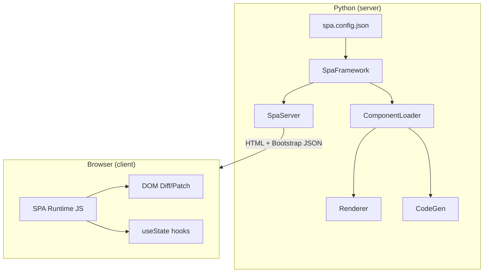
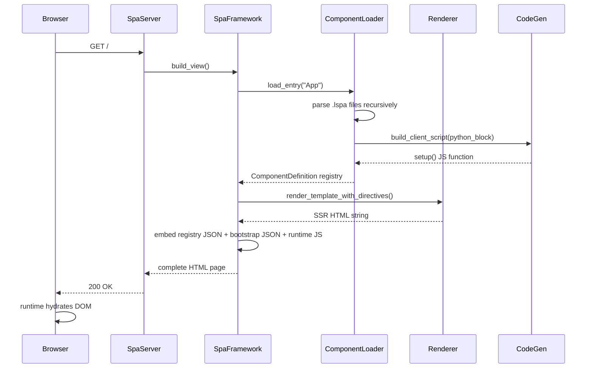
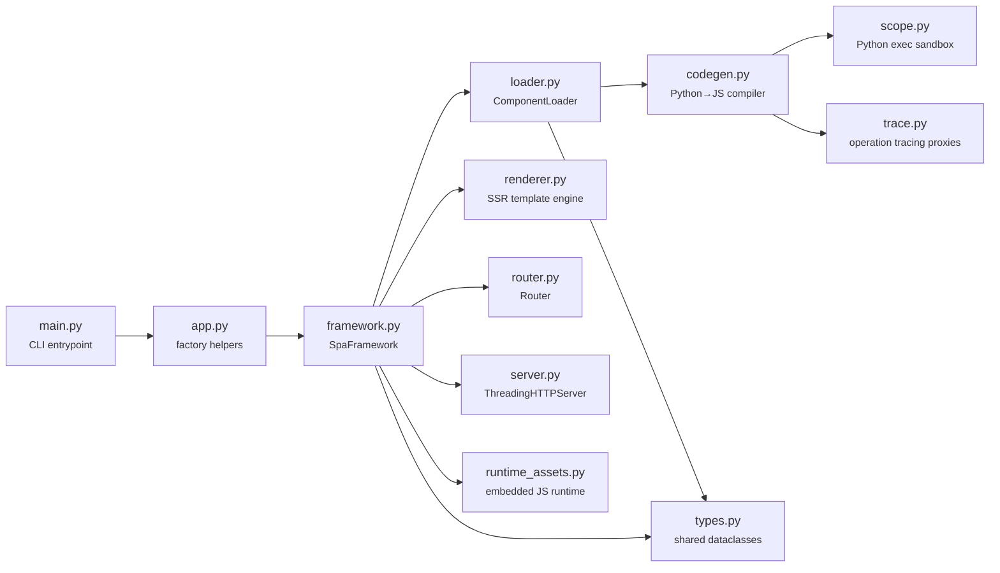

# Architecture

lua-spa is a Python-first SPA framework that blends **server-side rendering** with **client-side hydration**. It has no JavaScript build step — the browser runtime is a single self-contained script embedded at build time.

## High-level architecture

## Request lifecycle

## Module map

## Design principles

1. **No build step** — The Python package ships a self-contained JS runtime. Users never run `npm`.
2. **SSR first** — Every page load starts as server-rendered HTML. JavaScript enhances, not replaces.
3. **Python is the authority** — Component logic lives in Python. JavaScript is generated automatically.
4. **Zero client dependencies** — The browser runtime has no external npm dependencies.
