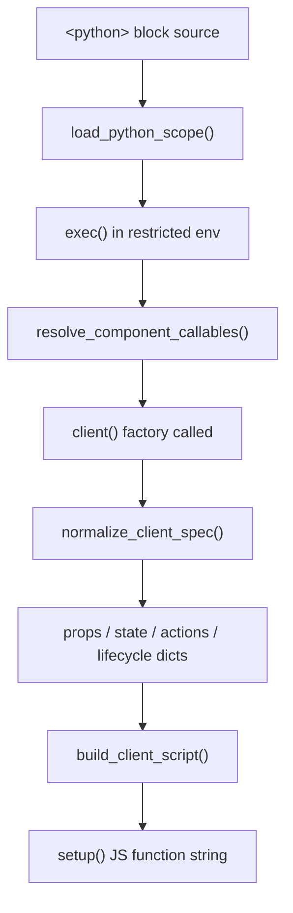
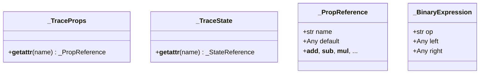

# Code Generator

`lua_spa.codegen` · `lua_spa.scope` · `lua_spa.trace`

These three modules form the **Python-to-JavaScript compiler** that turns a `client()` spec into a `setup()` JS function.

## Pipeline



## `load_python_scope(python_block) → dict`

`lua_spa.scope`

Executes the `<python>` block in a full Python environment (all built-ins available). Adds:
- `Component` base class
- `StateField` dataclass
- Tracing overrides for `int`, `float`, `str`, `bool` (so numeric defaults are captured correctly)

## `resolve_component_callables(scope)`

Returns `(context_fn, client_fn)` by looking for:
1. A `component()` callable factory
2. An explicit `Component` subclass
3. Any inferred `Component` subclass in the scope

## Tracing proxies (`lua_spa.trace`)

When `client()` runs during code generation, `self.state` and `self.props` are replaced with **proxy objects** that record accesses instead of returning real values:



This allows expressions like `self.add("count", props.initialCount + 1)` to be converted to a JavaScript expression rather than evaluated eagerly in Python.

## Generated `setup()` structure

```js
function setup({ useState, props }) {
  // 1. Resolve and coerce props
  const resolvedProps = Object.assign({}, { name: "default" }, props || {});

  // 2. useState hooks
  const [__state_0, __set_state_0] = useState(0);

  // 3. Actions object
  const actions = {
    increment: function () { __set_state_0(__state_0 + 1); },
    reset:     function () { __set_state_0(0); },
  };

  // 4. __callAction dispatcher
  function __callAction(actionName, event) { ... }

  // 5. Lifecycle hooks
  const lifecycle = {
    onCreate:  function () {},
    onMount:   function () { __callAction("init"); },
    onUpdate:  function () {},
    onUnmount: function () {},
  };

  // 6. Exposed state + return
  const state = { count: __state_0 };
  return { props: resolvedProps, state, actions, lifecycle };
}
```

## Operation mapping

### Computed variables (`context()` → `py` namespace)

`context(self, props)` is evaluated **server-side** by `build_python_context()` in `renderer.py`.
It is never compiled to JavaScript — its result is a plain Python dict injected into the render context as `py`.

```python
# Python
class Card(Component):
    def context(self, props):
        price = props.get("price", 0)
        return {
            "display":  f"${price:.2f}",
            "is_cheap": price < 10,
        }
```

```
Render context passed to template:
{
  "props": { "price": 7 },
  "state": { ... },
  "py":    { "display": "$7.00", "is_cheap": True }
}
```

Template access:
```html
<p>{{ py.display }}</p>          <!-- explicit namespace -->
<p l-if="is_cheap">On sale!</p>  <!-- flat / shorthand -->
```

`py` values are baked into the server-rendered HTML. They do **not** appear in the generated `setup()` function.

---

### State (`client()` → `useState` hooks)

Each state field in `client()` compiles to a `useState` hook. The initial value expression depends on how the field is declared:

| Python declaration | Internal spec | Generated JS |
|---|---|---|
| `"count": 0` | `{"default": 0}` | `useState(0)` |
| `"name": "lua"` | `{"default": "lua"}` | `useState("lua")` |
| `StateField("n", default=0, cast="int")` | `{"default": 0, "cast": "int"}` | `useState(0)` |
| `StateField("q", from_prop="qty", default=1, cast="int")` | `{"from_prop": "qty", "default": 1, "cast": "int"}` | `useState(Number(resolvedProps["qty"] ?? 1))` |

Example — full Python → JS compilation:

```python
# Python
class Counter(Component):
    def client(self):
        return {
            "state": {
                "count": 0,
                "label": "start",
            },
        }
```

```js
// Generated setup() (excerpt)
const [__state_0, __set_state_0] = useState(0);      // count
const [__state_1, __set_state_1] = useState("start"); // label

const state = { count: __state_0, label: __state_1 };
```

---

### Actions — Style 1 (dict in `client()`)

Dict-style actions use `self.add()`, `self.sub()`, `self.set()`, `self.toggle()` which return plain operation dicts. These are processed by `_normalize_action_operation()` then compiled by `_js_action_statement()`.

| Python | Internal operation dict | Generated JS action body |
|---|---|---|
| `self.add("count")` | `{"op":"add","state":"count","value":1}` | `__set_state_0(function(v){return v+1;});` |
| `self.add("count", 5)` | `{"op":"add","state":"count","value":5}` | `__set_state_0(function(v){return v+5;});` |
| `self.sub("count")` | `{"op":"sub","state":"count","value":1}` | `__set_state_0(function(v){return v-1;});` |
| `self.set("flag", True)` | `{"op":"set","state":"flag","value":True}` | `__set_state_1(function(){return true;});` |
| `self.toggle("flag")` | `{"op":"toggle","state":"flag"}` | `__set_state_1(function(v){return !v;});` |

Full example (using Style 2 for comparison — same JS output):

```python
# Python
class Counter(Component):
    def client(self):
        return {"state": {"count": 0}}

    def increment(self):
        self.state.count += 1

    def reset(self):
        self.state.count = 0
```

```js
// Generated setup() (excerpt)
const [__state_0, __set_state_0] = useState(0);

const actions = {
  increment: function () {
    __set_state_0(function (value) { return value + 1; });
  },
  reset: function () {
    __set_state_0(function () { return 0; });
  },
};
```

---

### Actions — Style 2 (Python methods, traced)

Method-style actions are **traced**: the framework runs the method with `self.state` replaced by a `_TraceState` proxy that records each assignment and comparison as an operation dict.

```python
# Python
class Counter(Component):
    def client(self):
        return {"state": {"count": 0}}

    def safe_increment(self):
        if self.state.count < 10:    # comparison → captured as "cond"
            self.state.count += 1    # += → captured as "add" op
```

Tracing records:

```python
# Internal operation list produced by _TraceState
[
  {
    "op": "add",
    "state": "count",
    "value": 1,
    "cond": {"left": "count", "op": "<", "right": 10}
  }
]
```

Generated JS:

```js
safe_increment: function () {
  if (__state_0 < 10) {
    __set_state_0(function (value) { return value + 1; });
  }
},
```

#### Conditional operators captured by `_TraceState`

State variables are named by **enumeration order**, not by field name: the first state field is `__state_0`, the second `__state_1`, and so on. The field name (`x`) is only used as a lookup key — it never appears in the JS variable name.

| Python comparison | `cond.op` | JS guard (where `__state_0` is the variable for `x`) |
|---|---|---|
| `self.state.x < n`  | `"<"`  | `if (__state_0 < n)` |
| `self.state.x <= n` | `"<="` | `if (__state_0 <= n)` |
| `self.state.x > n`  | `">"`  | `if (__state_0 > n)` |
| `self.state.x >= n` | `">="` | `if (__state_0 >= n)` |
| `self.state.x == n` | `"=="` | `if (__state_0 == n)` |
| `self.state.x != n` | `"!="` | `if (__state_0 != n)` |

#### Multi-step traced method

```python
def restart(self):
    self.state.score     = 0       # → {"op":"set","state":"score","value":0}
    self.state.lives     = 3       # → {"op":"set","state":"lives","value":3}
    self.state.game_over = False   # → {"op":"set","state":"game_over","value":False}
```

```js
restart: function () {
  __set_state_0(function () { return 0; });
  __set_state_1(function () { return 3; });
  __set_state_2(function () { return false; });
},
```
