# Performance

## What makes lua-spa fast

### Server-side rendering (SSR)

Every page load delivers pre-rendered HTML. The browser paints content immediately — no blank screen while JavaScript loads.

```mermaid
gantt
    title Page load timeline comparison
    dateFormat X
    axisFormat %s

    section lua-spa
    HTML delivered (SSR) : 0, 1
    Runtime hydration     : 1, 2
    Interactive           : 2, 3

    section SPA (JS only)
    Empty shell delivered : 0, 1
    JS bundle downloaded  : 1, 3
    Component renders     : 3, 5
    Interactive           : 5, 6
```

### Selective DOM diffing

The runtime only patches nodes that actually changed. Large parts of the DOM are untouched on state updates.

### No virtual DOM allocation

lua-spa's differ works directly on real DOM nodes using `document.createTreeWalker`. There is no intermediate VDOM object tree to allocate and garbage-collect.

### Inline CSS

Stylesheets are inlined at load time by the `ComponentLoader`. The browser never makes separate CSS requests.

### Single JS bundle

The entire runtime is embedded in the page as a `<script>` block — one HTTP request for HTML, zero additional JS requests.

## Hot reload overhead

With `--reload`, the server polls all watched files every 500ms. Components are re-loaded from disk and the view is rebuilt. This only affects development.

## Tips

| Goal | Approach |
|---|---|
| Reduce initial props | Only pass what the entry component needs |
| Avoid unnecessary re-renders | Don't use `updated` lifecycle for side effects that don't need every update |
| Large lists | Use `key` attributes to help the differ reuse nodes |
| Static content | Put non-interactive content outside the mounted `#app` div in `index.lspa` |
