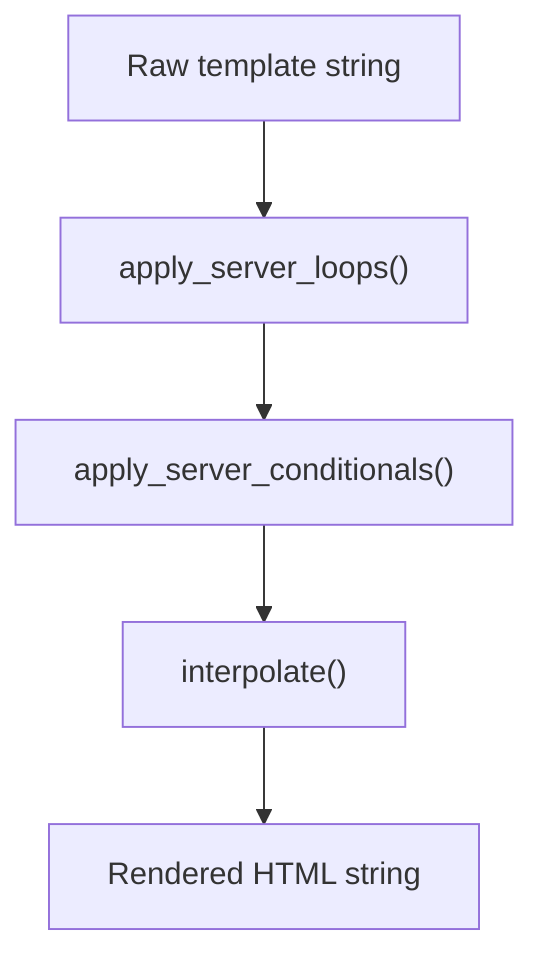
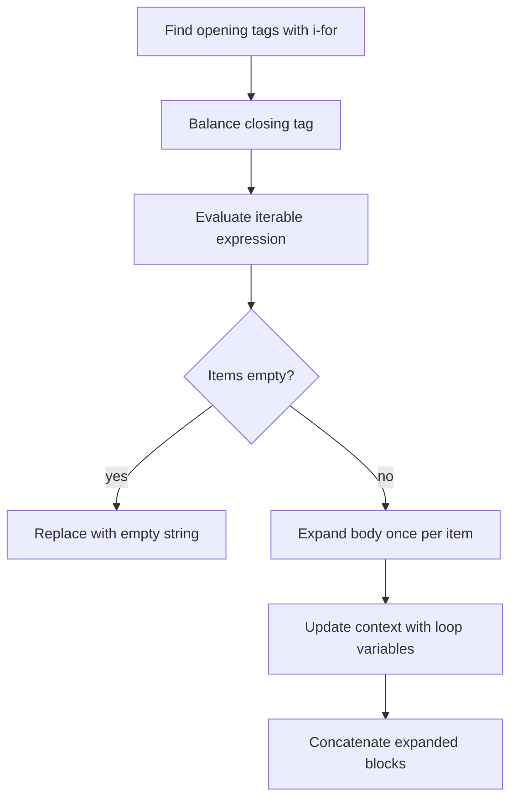
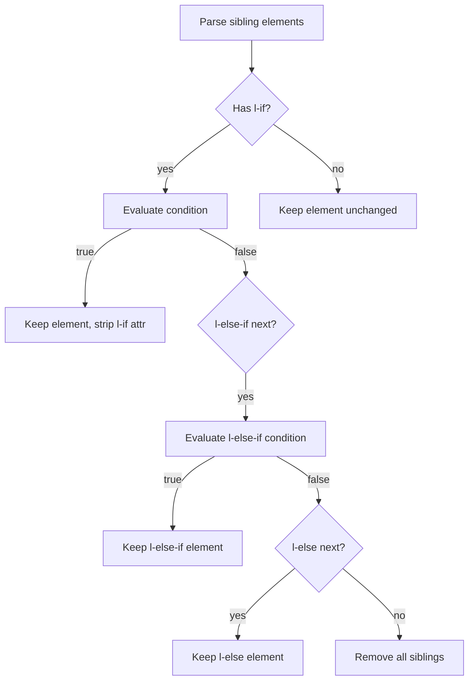

# Rendering Engine

`lua_spa.renderer`

The server-side template engine that converts `.lspa` templates into HTML before the page is sent to the browser.

## Processing pipeline



Each pass operates on the string produced by the previous pass. This ordering ensures:
- Loop bodies can contain conditionals
- Conditionals can contain `{{ }}` expressions
- Expressions are always evaluated last on final content

## `render_template_with_directives(template, context)`

Main entry point. Accepts a template string and a context dict (`props`, `state`, `py`).

```python
html = render_template_with_directives(
    "<p l-if=\"count > 0\">{{ count }}</p>",
    {"state": {"count": 3}, "props": {}, "py": {}}
)
# "<p>3</p>"
```

## Loop expansion (`i-for`)



Multi-target unpacking is supported:

```html
<li i-for="i, item in enumerate(items)">{{ i }}: {{ item }}</li>
```

Nested loops work by re-running the pass until no more `i-for` attributes remain.

## Conditional rendering (`l-if`)



## Interpolation (`{{ }}`)

All `{{ expr }}` tokens in the final string are replaced by evaluating `expr` in a safe Python context:

```python
_SAFE_EVAL_GLOBALS = {
    "__builtins__": {},
    "range": range,
    "len": len,
    "enumerate": enumerate,
}
```

The template context adds `state`, `props`, and `py` on top of these globals.

## Context object

```python
context = {
    "state":  {...},  # from setup() state
    "props":  {...},  # from parent or initial_props
    "py":     {...},  # from setup().data
}
```

`build_python_context(...)` and `build_server_state(...)` in `renderer.py` assemble this dict from `setup(self, props)` output before rendering.
