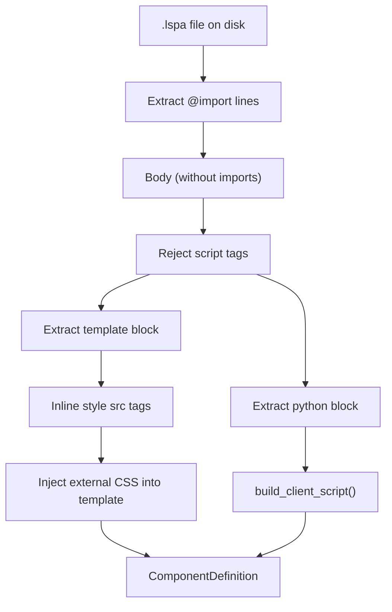
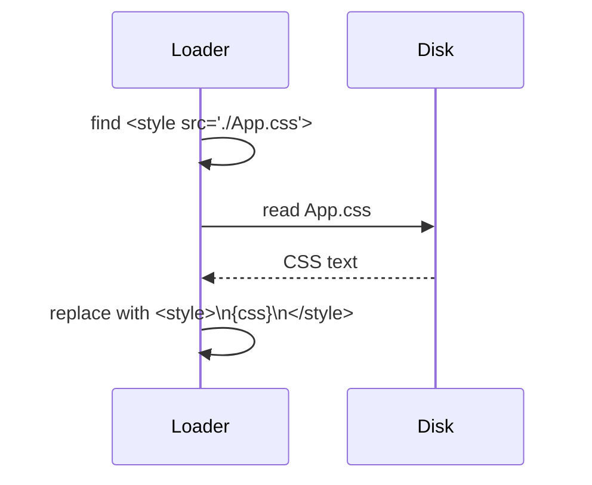

# Template Parser & Component Loader

`moon_spa.loader.ComponentLoader`

Reads `.lspa` files from disk, extracts their sections, and builds the component registry.

## Parsing a `.lspa` file



## `@import` syntax

```
@import Alias from "./relative/path/To.lspa"
```

- Must be at the start of a line
- Path is relative to the current component file
- The alias becomes the tag name used in `<template>`

Imports are resolved **recursively**: loading `App` triggers loading `Hero`, `Nav`, etc., populating the full registry before any rendering begins.

## `<python>` block extraction

Regex: `<python>(.*?)</python>` (case-insensitive, dotall)

The extracted source is:
1. Passed to `build_client_script()` for JS generation
2. Stored as `ComponentDefinition.python_block` for server-side `setup(self, props)` execution

## `<style src="...">` inlining



This happens at **load time**, so the rendered HTML always contains inline `<style>` blocks — no external CSS requests.

## `ComponentLoader` API

### `__init__(components_dir: Path)`

### `load_entry(entry_component: str) → Mapping[str, ComponentDefinition]`

Loads the entry component and all its transitive imports. Returns the full registry.

**Raises:**
- `FileNotFoundError` if any `.lspa` file is missing
- `ValueError` if a `<script>` tag is found (use `<python>` instead)

### `components → Mapping[str, ComponentDefinition]`

Read-only view of the loaded registry.

## `<script>` tag restriction

`.lspa` files **must not** contain `<script>` tags. This is enforced at load time:

```
ValueError: Component 'MyComp' uses <script>; use a <python> block with Component.setup(self, props)
```

The reason: JavaScript is generated from Python setup specs. Mixing hand-written `<script>` tags would break the hydration contract.
