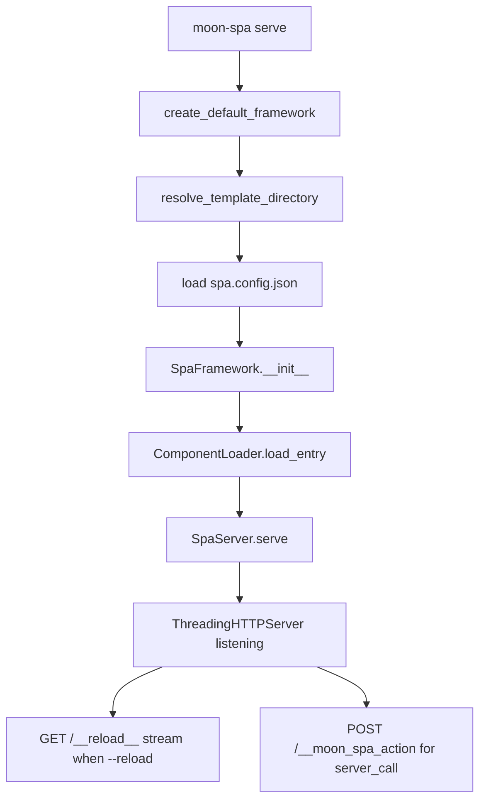

# CLI Reference

The `moon-spa` command-line tool.

```
moon-spa <command> [options]
```

## Commands

### `moon-spa create <name>`

Scaffold a new project by copying the built-in `moon_template` into a new directory.

```bash
moon-spa create my_app
```

| Argument | Description |
|---|---|
| `name` | Project name (letters, numbers, underscore — no spaces) |

**Optional path:**

```bash
moon-spa create my_app ./apps
```

| Argument | Default | Description |
|---|---|---|
| `path` | `.` | Destination directory where the project folder is created |

**Errors:**
- `ValueError` if the name contains invalid characters
- `FileExistsError` if the directory already exists

---

### `moon-spa serve`

Start the development server.

```bash
moon-spa serve
moon-spa serve --reload
```

| Option | Description |
|---|---|
| `--reload` | Watch `.lspa`, `.py`, `.css`, `.js` for changes and live-reload the browser |

Prints the server URL on startup:

```
Serving moon-spa at http://127.0.0.1:8000

With `--reload`, the watcher path is shown relative to the current working directory:

```text
Live reload activated. Watching src for file changes...
```

---

### `moon-spa new component <name> [path]`

Create a new component by copying `ComponentTemplate`, renaming files/content,
and writing it into `moon_template/components/<name>/`.

```bash
moon-spa new component UserCard
moon-spa new component UserCard ./apps/my_project
```

| Argument | Default | Description |
|---|---|---|
| `name` | — | Component name (Python identifier, e.g. `UserCard`) |
| `path` | `.` | Project root where `moon_template` exists |

CLI output includes the exact created locations:

```text
Component created at: <...>/components/UserCard/UserCard.lspa
Style created at: <...>/components/UserCard/UserCard.css
```
```

With `--reload`, the watcher path is shown relative to the current working directory:

```text
Live reload activated. Watching src for file changes...
```

---

### `moon-spa new component <name> [path]`

Create a new component by copying `ComponentTemplate`, renaming files/content,
and writing it into `moon_template/components/<name>/`.

```bash
moon-spa new component UserCard
moon-spa new component UserCard ./apps/my_project
```

| Argument | Default | Description |
|---|---|---|
| `name` | — | Component name (Python identifier, e.g. `UserCard`) |
| `path` | `.` | Project root where `moon_template` exists |

CLI output includes the exact created locations:

```text
Component created at: <...>/components/UserCard/UserCard.lspa
Style created at: <...>/components/UserCard/UserCard.css
```

## Invoke via Python module

```bash
python -m moon_spa serve --reload
python -m moon_spa create my_app
python -m moon_spa new component UserCard
```

## Serve flow


