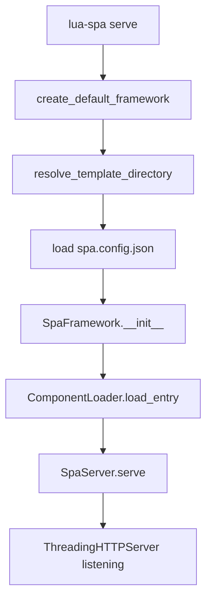

# CLI Reference

The `lua-spa` command-line tool.

```
lua-spa <command> [options]
```

## Commands

### `lua-spa create <name>`

Scaffold a new project by copying the built-in `lua_template` into a new directory.

```bash
lua-spa create my_app
```

| Argument | Description |
|---|---|
| `name` | Project name (letters, numbers, underscore — no spaces) |

**Optional:**

```bash
lua-spa create my_app --dest /path/to/destination
```

| Option | Default | Description |
|---|---|---|
| `--dest` | Current directory | Where to create the project folder |

**Errors:**
- `ValueError` if the name contains invalid characters
- `FileExistsError` if the directory already exists

---

### `lua-spa serve`

Start the development server.

```bash
lua-spa serve
lua-spa serve --reload
```

| Option | Description |
|---|---|
| `--reload` | Watch `.lspa`, `.py`, `.css`, `.js` for changes and live-reload the browser |

Prints the server URL on startup:

```
Serving lua-spa at http://127.0.0.1:8000
```

## Invoke via Python module

```bash
python -m lua_spa serve --reload
python -m lua_spa create my_app
```

## Serve flow


