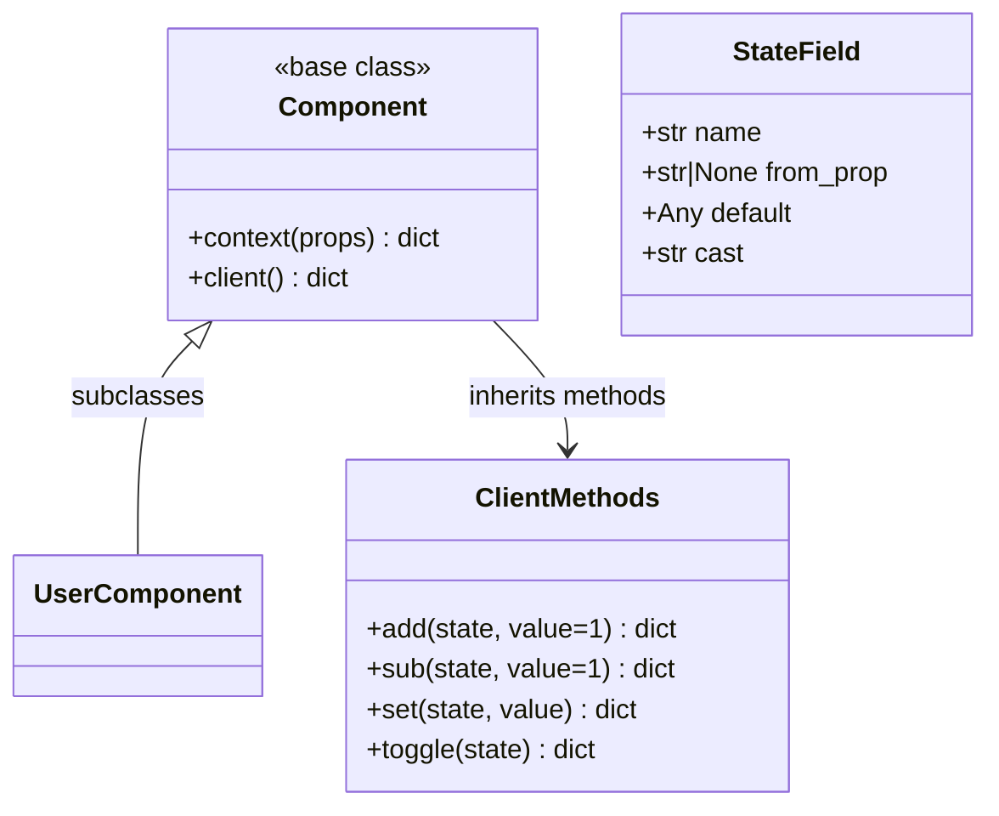

# Component API

Types and base classes used when writing `.lspa` component Python blocks.

## Class diagram



## `Component`

Base class for all components. Available as `Component` in every `<python>` block (no import needed).

```python
class MyComponent(Component):
    def context(self, props):
        return {"title": props.get("title", "Default")}

    def client(self):
        return {
            "props":   {"title": "Default"},
            "state":   {"count": 0},
            "actions": {"inc": self.add("count")},
            "lifecycle": {"onMount": ["inc"]},
        }
```

### `context(self, props) → dict`

Called server-side when rendering the template. Returns a dict that becomes the `py` namespace in `{{ }}` expressions.

| Parameter | Type | Description |
|---|---|---|
| `props` | `dict` | Props passed from parent or `initial_props` |

**Returns:** Dict of template variables (accessible as `py.<key>` or directly by name in `{{ }}`).

### `client(self) → dict`

Inspected at **build time** by the code generator to produce the `setup()` JavaScript function. The return value is a spec dict:

```python
{
    "props":     { "name": "default" },       # expected props + defaults
    "state":     { "count": 0 },              # reactive state
    "actions":   { "inc": self.add("count") }, # state mutations
    "lifecycle": { "onMount": ["inc"] },       # lifecycle hooks
}
```

## `ClientMethods`

Mixin methods inherited by `Component`. Each returns an **operation dict** that the code generator translates to JavaScript.

### `add(state, value=1) → dict`

Increment a state field.

```python
self.add("count")        # count += 1
self.add("count", 5)     # count += 5
```

### `sub(state, value=1) → dict`

Decrement a state field.

```python
self.sub("count")        # count -= 1
self.sub("count", 2)     # count -= 2
```

### `set(state, value) → dict`

Assign a fixed value to a state field.

```python
self.set("name", "lua-spa")
self.set("count", 0)
```

### `toggle(state) → dict`

Flip a boolean state field.

```python
self.toggle("visible")   # visible = !visible
```

## `StateField`

Declarative state initialization. Use when state should be seeded from a prop.

```python
from lua_spa.types import StateField

def client(self):
    return {
        "state": {
            "count": StateField(
                name="count",
                from_prop="initialCount",
                default=0,
                cast="int",
            )
        }
    }
```

| Field | Type | Default | Description |
|---|---|---|---|
| `name` | `str` | — | State variable name |
| `from_prop` | `str \| None` | `None` | Prop name to seed from |
| `default` | `Any` | `None` | Fallback value if prop absent |
| `cast` | `str` | `"raw"` | Type coercion: `"int"`, `"float"`, `"str"`, `"bool"`, `"raw"` |

## `ComponentDefinition`

Internal dataclass representing a parsed `.lspa` file.

| Field | Type | Description |
|---|---|---|
| `name` | `str` | Component name |
| `template` | `str` | HTML template string |
| `client_script` | `str` | Compiled `setup()` JS function |
| `python_block` | `str` | Raw `<python>` source |
| `imports` | `Mapping[str, str]` | `{alias: alias}` import map |
