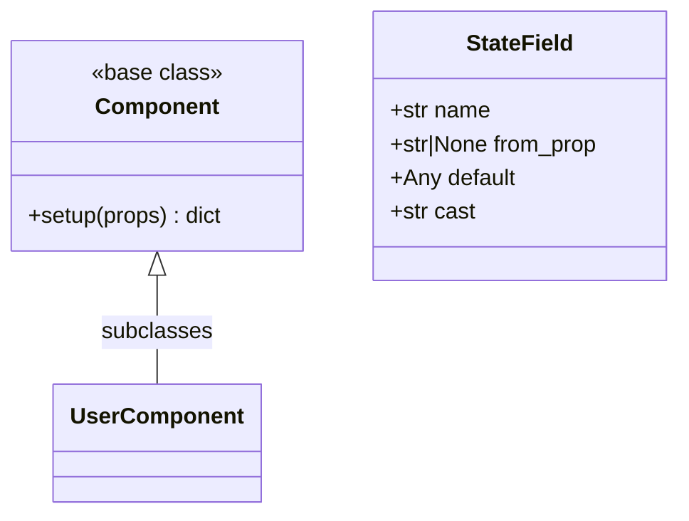

# Component API

Types and base classes used when writing `.lspa` component Python blocks.

## Class diagram



## `Component`

Base class for all components. Available as `Component` in every `<python>` block (no import needed).

```python
class MyComponent(Component):
    def setup(self, props):
        props = {"title": "Default", **props}
        state = {"count": 0}
        data = {"headline": "hello"}

        def inc():
            state["count"] += 1

        def mounted():
            inc()

```

### `setup(self, props) → dict`

Called whenever the component is prepared for rendering/hydration. This is the only supported component contract.

| Parameter | Type | Description |
|---|---|---|
| `props` | `dict` | Props passed from parent or `initial_props` |

**Returns:** A mapping with keys:

- `props`: merged props defaults
- `state`: reactive state values
- `data`: server data exposed as `py.*` in templates
- `actions`: mapping of action names to either callables or op mappings
- `lifecycle`: mapping of lifecycle hook names to callables/strings/mappings/lists

If `setup` returns `None`, the server infers the mapping automatically from:

- local variables: `props`, `state`, `data`
- local callables inferred as `actions`
- lifecycle-named callables (like `mounted`, `created`, `on_mount`, etc) inferred as `lifecycle`

When actions/lifecycle mutate `data`, those `data` keys are automatically emitted in the props patch even without returning a mapping from the action.

### Action operations

Declarative action mappings support these operations:

- `set`, `add`, `sub`, `toggle`
- `multi` (list of operations)
- `log` (emits browser `console.log`)
- `js` (raw JavaScript statement)
- `set_prop` (updates `props` payload)
- `server_call` (invokes `POST /__lua_spa_action`)

Callable actions/lifecycle hooks are normalized into `server_call` operations.

### Lifecycle names

Supported canonical lifecycle hooks in generated client scripts:

- `onCreate`
- `onMount`
- `onUpdate`
- `onUnmount`

Setup may declare aliases like `mounted`, which are normalized to canonical hook names.

## `StateField`

Declarative state field metadata. Use as class/object attributes when state should be seeded from a prop.

```python
from lua_spa.types import StateField

class Example(Component):
    def setup(self, props):
        state = {
            "count": StateField(name="count", from_prop="initialCount", default=0, cast="int")
        }
        return {
            "props": props,
            "state": state,
            "data": {},
            "actions": {},
            "lifecycle": {},
        }
```

| Field | Type | Default | Description |
|---|---|---|---|
| `name` | `str` | — | State variable name |
| `from_prop` | `str \| None` | `None` | Prop name to seed from |
| `default` | `Any` | `None` | Fallback value if prop absent |
| `cast` | `str` | `"raw"` | Type coercion: `"int"`, `"float"`, `"str"`, `"bool"`, `"raw"` |

## `ComponentDefinition`

Internal dataclass representing a parsed `.lspa` file.

| Field | Type | Description |
|---|---|---|
| `name` | `str` | Component name |
| `template` | `str` | HTML template string |
| `client_script` | `str` | Compiled `setup()` JS function |
| `python_block` | `str` | Raw `<python>` source |
| `imports` | `Mapping[str, str]` | `{alias: alias}` import map |
