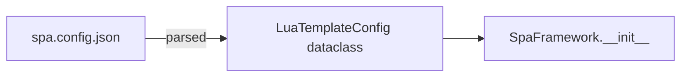

# spa.config.json

The project configuration file, placed at the root of the `lua_template` directory.

## Full schema

```json
{
  "page_title": "my_app",
  "mount_id": "app",
  "initial_props": {
    "user": "guest"
  },
  "server": {
    "host": "127.0.0.1",
    "port": 8000
  },
  "router": {
    "routes": [
      {
        "path": "/",
        "component": "Home",
        "props": {},
        "children": [],
        "index": false,
        "guard": null,
        "meta": {}
      }
    ]
  }
}
```

## Fields

| Field | Type | Default | Description |
|---|---|---|---|
| `page_title` | `string` | `"lua-spa"` | HTML `<title>` tag value |
| `mount_id` | `string` | `"app"` | DOM element ID where the app mounts |
| `initial_props` | `object` | `{}` | Default props passed to the entry component |
| `server.host` | `string` | `"127.0.0.1"` | Bind address |
| `server.port` | `number` | `8000` | Port |
| `router` | `object \| null` | `null` | Router configuration (see [Router API](/docs/api/router)) |

## Router Contract

When `router` is enabled:

- route rendering is driven by `router.routes`.
- matched components are rendered from the route stack.
- route groups can use `children` without defining a `component` on group nodes.
- when `router.initial_path` is `"/"`, initial render starts from the route that matches `"/"`.

## Minimal config

```json
{
  "page_title": "hello",
  "server": { "host": "0.0.0.0", "port": 3000 }
}
```

## Config loading



`LuaTemplateConfig` is a frozen dataclass defined in `lua_spa.types`.
