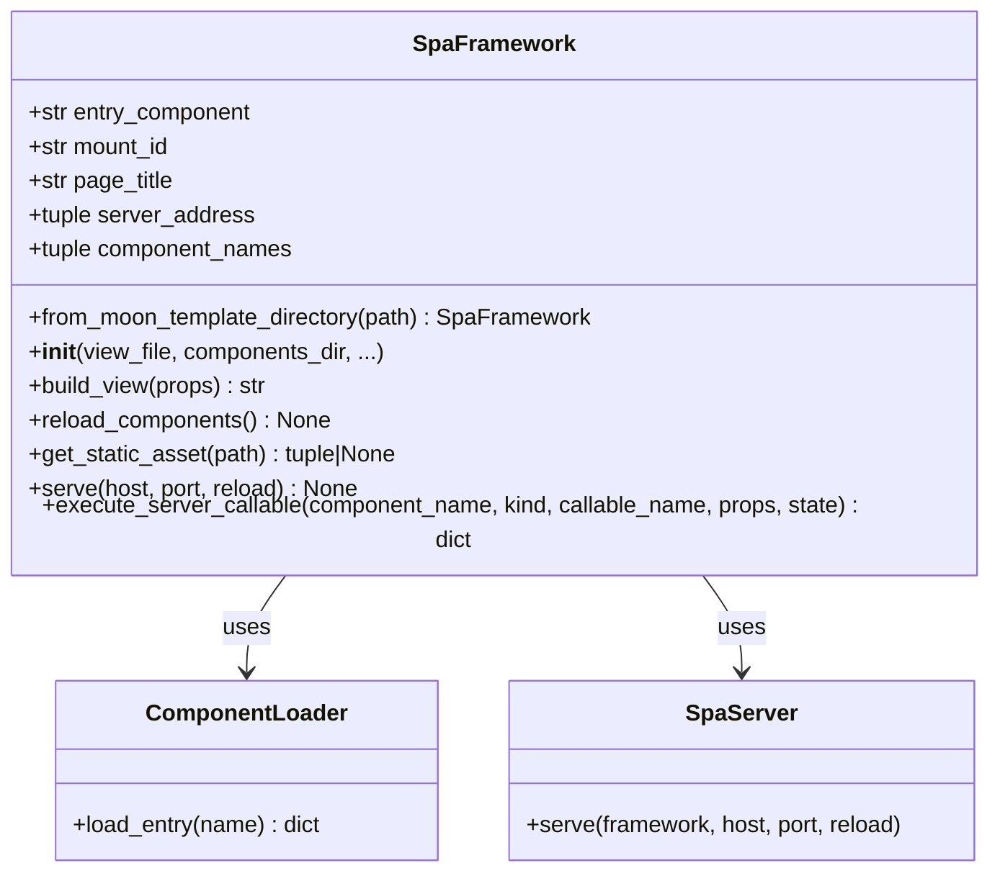

# SpaFramework

`moon_spa.framework.SpaFramework`

The main entry point for the moon-spa Python API. Orchestrates loading, rendering, and serving.

## Class diagram



## Factory method

### `SpaFramework.from_moon_template_directory(moon_template_dir)`

Creates a framework instance from a `moon_template/` directory.

```python
from pathlib import Path
from moon_spa.framework import SpaFramework

fw = SpaFramework.from_moon_template_directory(Path("my_app"))
```

Reads `spa.config.json` from `moon_template_dir` to configure all options.

**Raises:** `FileNotFoundError` if `spa.config.json` or `index.lspa` are missing.

## Constructor

```python
SpaFramework(
    view_file: Path,
    components_dir: Path,
    static_dir: Path | None = None,
    entry_component: str = "App",
    mount_id: str = "app",
    default_props: Mapping[str, Any] | None = None,
    host: str = "127.0.0.1",
    port: int = 8000,
    page_title: str = "moon-spa",
    router: Mapping[str, Any] | None = None,
)
```

| Parameter | Type | Default | Description |
|---|---|---|---|
| `view_file` | `Path` | — | Path to `index.lspa` HTML shell |
| `components_dir` | `Path` | — | Path to components directory |
| `static_dir` | `Path \| None` | `view_file.parent/static` | Static assets directory |
| `entry_component` | `str` | `"App"` | Root component used when router is disabled |
| `mount_id` | `str` | `"app"` | DOM element ID for mount point |
| `default_props` | `Mapping \| None` | `None` | Default props for the entry component |
| `host` | `str` | `"127.0.0.1"` | Server bind host |
| `port` | `int` | `8000` | Server bind port |
| `page_title` | `str` | `"moon-spa"` | HTML `<title>` value |
| `router` | `Mapping \| None` | `None` | Router config (same shape as `spa.config.json` `router`) |

## Methods

### `build_view(props=None) → str`

Builds the complete HTML page.

```python
html = framework.build_view(props={"user": "alice"})
```

1. Reads `index.lspa` shell
2. Inlines `<style src="...">` tags
3. Renders server-side HTML:
    with router disabled: `entry_component`
    with router enabled: matched route stack from `router.routes`
4. Embeds the component registry JSON, bootstrap config, and runtime JS
5. Replaces all `{{ SPA_* }}` placeholders

**Returns:** Complete HTML string ready to send to the browser.

### `reload_components() → None`

Re-reads all `.lspa` files from disk without restarting the server. Called automatically when `--reload` is active.

### `get_static_asset(request_path) → tuple[bytes, str] | None`

Resolves a static file by HTTP path (e.g. `"/static/logo.png"`).

**Returns:** `(file_bytes, mime_type)` or `None` if not found.

### `serve(host=None, port=None, reload=False) → None`

Starts the HTTP server. Blocks until interrupted.

```python
framework.serve(reload=True)
```

When `reload=True`, the server exposes a Server-Sent Events stream at `GET /__reload__`
and injects a browser listener that reloads the page when source files change.

### `execute_server_callable(component_name, kind, callable_name, props, state) -> dict`

Executes callable actions/lifecycle hooks from `setup(self, props)` (explicit or inferred) and returns patch payload:

- `state`: updated state snapshot
- `props`: props/data patch to apply in browser (includes mutated `data` keys even when action returns `None`)

Used internally by `POST /__moon_spa_action` runtime bridge.

## Runtime HTTP endpoints


Internal bridge used by generated `server_call` operations.

Request body:

```json
{
    "component": "Features",
    "kind": "action",
    "name": "reload_packages",
    "props": {"versions_limit": 5},
    "state": {"loading": false}
}
```

`kind` values:
- `action`
- `lifecycle`

Success response (`200`):

```json
{
    "ok": true,
    "result": {
        "state": {"loading": false},
        "props": {
            "pypi": {"latest": "1.2.3", "available": true},
            "__moon_logs__": ["refresh finished"]
        }
    }
}
```

Error response (`400`):

```json
{
    "ok": false,
    "error": "Unknown action: reload_packages"
}
```

### `GET /__reload__`

Available when `serve(..., reload=True)` is enabled.

- Content type: `text/event-stream`
- Event payload emitted by server on file change:

```text
data: reload

```

Browser runtime behavior: on each message, it calls `window.location.reload()`.

## Properties
|---|---|---|
| `component_names` | `tuple[str, ...]` | Names of all loaded components |
| `server_address` | `tuple[str, int]` | `(host, port)` |
| `entry_component` | `str` | Root component used when router is disabled |
| `mount_id` | `str` | DOM mount ID |
| `page_title` | `str` | HTML page title |
