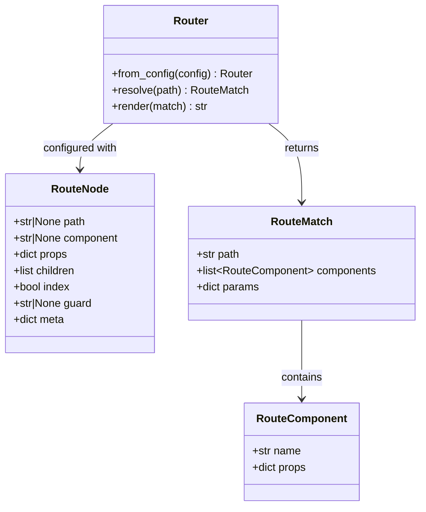
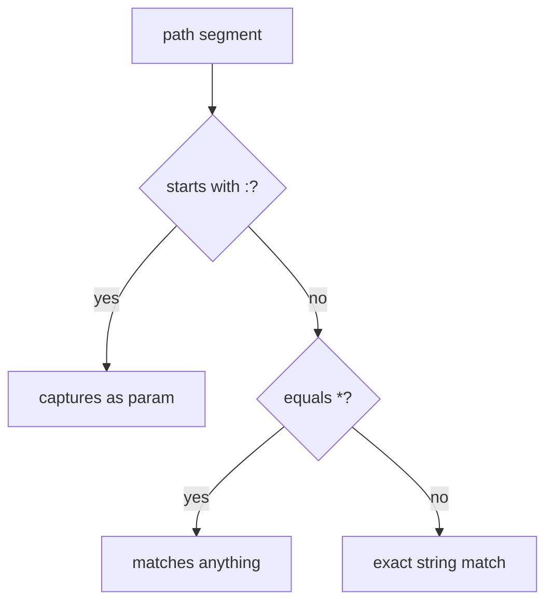

# Router API

`lua_spa.router.Router`

Resolves URL paths to cascaded component trees.

## Class diagram



## `Router.from_config(config)`

Create a Router from a config dict (same shape as the `"router"` key in `spa.config.json`):

```python
from lua_spa.router import Router

router = Router.from_config({
    "routes": [
        {"path": "/",        "component": "Home"},
        {"path": "/about",   "component": "About"},
        {"path": "/users/:id", "component": "UserDetail"},
    ]
})
```

## `Router.resolve(path) → RouteMatch`

Match a URL path against the route tree.

```python
match = router.resolve("/users/42")
# match.path       == "/users/42"
# match.params     == {"id": "42"}
# match.components == [RouteComponent(name="UserDetail", props={})]
```

**Raises:** `KeyError` if no route matches the path.

## `Router.render(match) → str`

Render a `RouteMatch` into cascaded HTML component tags:

```python
html = router.render(match)
# "<UserDetail id=\"42\" />"
```

For nested routes, produces a stack:

```python
# Route: /dashboard/settings
# "<Dashboard><Settings /></Dashboard>"
```

## `RouteNode` fields

| Field | Type | Default | Description |
|---|---|---|---|
| `path` | `str \| None` | `None` | URL segment (supports `:param` and `*` wildcard) |
| `component` | `str \| None` | `None` | Component name to render |
| `props` | `dict` | `{}` | Static props passed to component |
| `children` | `list[RouteNode]` | `[]` | Nested route definitions |
| `index` | `bool` | `False` | Index route (matches parent path exactly) |
| `guard` | `str \| None` | `None` | Guard name for future middleware |
| `meta` | `dict` | `{}` | Arbitrary metadata |

## Path matching rules



- `/users/:id` matches `/users/42` → `params = {"id": "42"}`
- `*` matches any remaining segments
- Static segments must match exactly (case-insensitive)
