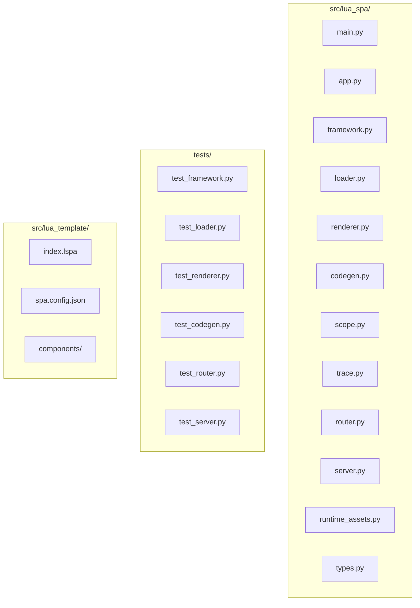
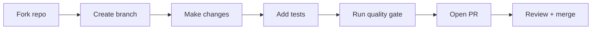

# Contributing to lua-spa

Thank you for your interest! This guide covers everything from opening an issue to submitting a pull request.

## Requirements

-   Python 3.10+
-   Poetry installed

## Development Workflow

Clone respository:
```bash
git clone https://github.com/roderiano/lua-spa.git
cd lua-spa
```


Run app:

``` bash
poetry install
```

Run app:

``` bash
poetry run lua-spa serve --reload
```

Run tests:

``` bash
poetry run pytest
```

Run coverage:

``` bash
poetry run pytest --cov=src/lua_spa --cov-report=term
```

Lint & typing:

``` bash
poetry run ruff check .
poetry run mypy src
```

## Code quality gate

```bash
python scripts/precommit_quality_gate.py
```

This runs linting, type-checking, and tests. All checks must pass before committing.

## Project layout (contributor view)



## Where to add things

| Change | File(s) |
|---|---|
| New template directive | `renderer.py` + `runtime_assets.py` (JS side) |
| New state operation | `types.py` (`ClientMethods`) + `codegen.py` |
| New CLI command | `main.py` |
| New router feature | `router.py` |
| New config field | `types.py` (`LuaTemplateConfig`) + `framework.py` |
| Default template | `src/lua_template/` |

## Contribution flow




## Branching Strategy

We use a structured branching model:

-   `staging` → Main development branch (feature aggregation)
-   `release` → Stable branch used to generate production packages

### Rules

-   All new features must branch from `staging`
-   All pull requests must target `staging`
-   `staging` accumulates code for upcoming releases
-   `release` is updated only when preparing a new version


## Contribution Rules

To ensure quality and traceability:

-   Every contribution **must be linked to a GitHub Issue**
-   If no issue exists, create one before starting
-   Reference the issue in your PR (e.g., `Closes #123`)

## How Can I Contribute?

### Reporting Bugs

Before creating bug reports, please check existing issues.

When creating a bug report, include:

-   Clear and descriptive title
-   Steps to reproduce
-   Expected vs actual behavior
-   Screenshots if possible


### Suggesting Enhancements

Enhancements are tracked as GitHub issues.

Include:

-   Clear title
-   Description
-   Current vs expected behavior


### Pull Requests

1.  Fork the repository
2.  Create your branch from `staging`
3.  Link your work to an issue
4.  Add tests if needed
5.  Ensure tests pass
6.  Ensure coverage is at least **90%**
7.  Run linting and type checks
8.  Open PR targeting `staging`


## Development Setup

``` bash
poetry install
```

Create a new branch:

``` bash
git checkout staging
git checkout -b feature/your-feature-name
```

We follow Conventional Branches:

    type/your-feature-name

Examples:
-   feature/your-feature-name
-   fix/your-feature-name
-   docs/your-feature-name


## Development Workflow

Run app:

``` bash
poetry run lua-spa serve --reload
```

Run tests:

``` bash
poetry run pytest
```

Run coverage:

``` bash
poetry run pytest --cov=src/lua_spa --cov-report=term
```

Lint & typing:

``` bash
poetry run ruff check .
poetry run mypy src
```

## Proposing features

Open a GitHub Discussion or Issue before writing code. Discuss the design first to avoid duplicate effort.


## Commit Guidelines

We follow Conventional Commits:

    type(scope): description

Examples:

-   feat(component): add new hook
-   fix(runtime): resolve hydration bug
-   docs(readme): update usage


## Before Submitting a PR

Make sure:

-   Linked to an issue
-   Tests passing
-   Coverage ≥ 90%
-   Lint and type checks passing
-   PR targets `staging`


## Pre-commit

``` bash
poetry run pre-commit install
poetry run pre-commit run --all-files
```


## Release Process

-   Merge `staging` → `release`
-   Generate package
-   Tag version


Thanks for contributing 🚀
