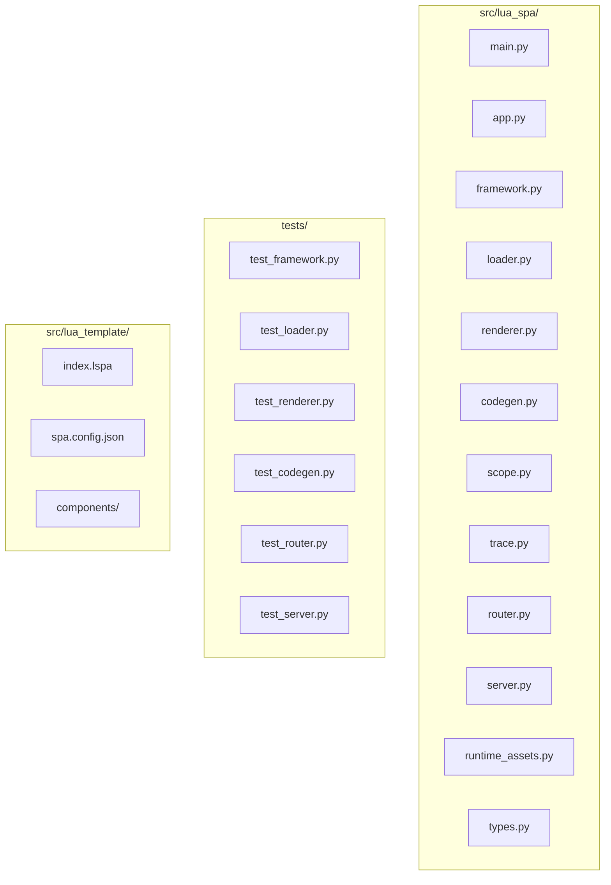
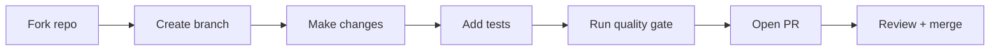

# Contributing to lua-spa

Thank you for your interest! This guide covers everything from opening an issue to submitting a pull request.

## Development setup

```bash
git clone https://github.com/roderiano/lua-spa.git
cd lua-spa
python -m venv .venv
source .venv/bin/activate   # Windows: .venv\Scripts\activate
pip install -e ".[dev]"
```

## Running tests

```bash
pytest
```

Or with coverage:

```bash
pytest --cov=lua_spa --cov-report=term-missing
```

## Code quality gate

```bash
python scripts/precommit_quality_gate.py
```

This runs linting, type-checking, and tests. All checks must pass before committing.

## Project layout (contributor view)



## Where to add things

| Change | File(s) |
|---|---|
| New template directive | `renderer.py` + `runtime_assets.py` (JS side) |
| New state operation | `types.py` (`ClientMethods`) + `codegen.py` |
| New CLI command | `main.py` |
| New router feature | `router.py` |
| New config field | `types.py` (`LuaTemplateConfig`) + `framework.py` |
| Default template | `src/lua_template/` |

## Contribution flow



## Commit message convention

```
type: short description

Types: feat, fix, docs, test, refactor, chore
```

Examples:
- `feat: add l-show directive`
- `fix: balance nested i-for loops correctly`
- `docs: add hydration guide`

## Reporting bugs

Please include:
1. Python version (`python --version`)
2. lua-spa version (`pip show lua-spa`)
3. Minimal reproducer (`.lspa` content + error output)

## Proposing features

Open a GitHub Discussion or Issue before writing code. Discuss the design first to avoid duplicate effort.
