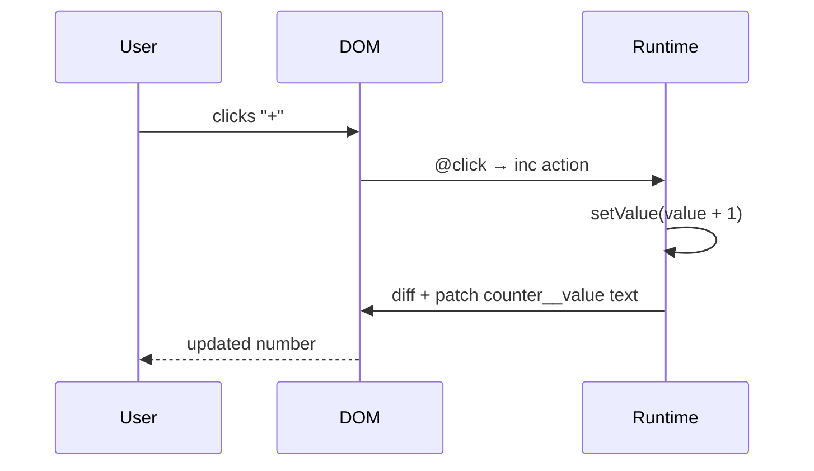

# Counter

The simplest interactive component: a click counter with increment, decrement, and reset.

## Full source

`components/Counter/Counter.lspa`

```html
<python>
class Counter(Component):
    def context(self, props):
        return {}

    def client(self):
    class Props:
      label = "count"
      step = 1

    class State:
      value = 0

    class ClientSpec:
      Props = Props
      State = State
      Methods = ["inc", "dec", "reset"]

    return ClientSpec()

    def inc(self):
        self.state.value += 1

    def dec(self):
        self.state.value -= 1

    def reset(self):
        self.state.value = 0
</python>

<template>
  <div class="counter">
    <span class="counter__label">{{ props.label }}</span>
    <span class="counter__value">{{ state.value }}</span>
    <div class="counter__buttons">
      <button @click="dec">−</button>
      <button @click="reset">0</button>
      <button @click="inc">+</button>
    </div>
  </div>
</template>
```

`App.lspa`

```html
@import Counter from './Counter/Counter.lspa'

<python>
class App(Component):
    pass
</python>

<template>
  <div class="page">
    <Counter label="score" />
    <Counter label="lives" />
  </div>
</template>
```

## How it works



## Key patterns

- Multiple instances of the same component each have **independent state**
- `props.label` is passed from the parent as a static string attribute
- `self.state.value += 1` in a method compiles to a reactive setter in JavaScript
