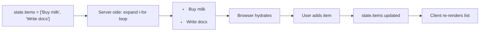

# Dynamic List

A todo list that adds and removes items — demonstrating `i-for` with reactive state.

## Component

`components/TodoList/TodoList.lspa`

```html
<python>
class TodoList(Component):
  def setup(self, props):
    state = {"items": ["Buy milk", "Write docs"], "draft": ""}

    def setDraft():
      state["draft"] = ""

    def clearAll():
      state["items"] = []

    def addItem():
      if state["draft"]:
        state["items"] = [*state["items"], state["draft"]]
        state["draft"] = ""

    # Optional: The server can infer this return automatically.
    return {
      "props": props,
      "state": state,
      "data": {},
      "actions": {"setDraft": setDraft, "clearAll": clearAll, "addItem": addItem},
      "lifecycle": {},
    }
</python>

<template>
  <div class="todo">
    <ul>
      <li i-for="item in state.items" class="todo__item">
        {{ item }}
      </li>
    </ul>

    <div class="todo__input">
      <input type="text" :value="state.draft" @input="setDraft" placeholder="New item..." />
      <button @click="addItem">Add</button>
    </div>

    <button l-if="state.items.length > 0" @click="clearAll">Clear all</button>
  </div>
</template>
```

## How `i-for` renders



## Pattern notes

- `i-for="item in state.items"` works the same on server and client
- `l-if="state.items.length > 0"` hides the button for empty lists
- For true dynamic `push`/`splice` on arrays you can use `backend-integration` to seed items from server props
