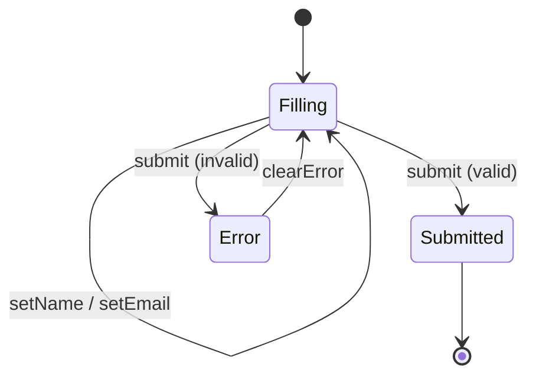

# Form Handling

A controlled form with input binding, validation state, and submit feedback.

## Component

`components/ContactForm/ContactForm.lspa`

```html
<python>
class ContactForm(Component):
  def setup(self, props):
    state = {"name": "", "email": "", "submitted": False, "error": ""}

    def setName():
      state["name"] = ""

    def setEmail():
      state["email"] = ""

    def submit():
      state["submitted"] = True

    def clearError():
      state["error"] = ""

    return {
      "props": props,
      "state": state,
      "data": {},
      "actions": {
        "setName": setName,
        "setEmail": setEmail,
        "submit": submit,
        "clearError": clearError,
      },
      "lifecycle": {},
    }
</python>

<template>
  <form class="form">
    <div l-if="state.submitted" class="form__success">
      Thank you!
    </div>

    <div l-else>
      <label>
        Name
        <input type="text" :value="state.name" @input="setName" />
      </label>

      <label>
        Email
        <input type="email" :value="state.email" @input="setEmail" />
      </label>

      <p l-if="state.error" class="form__error">{{ state.error }}</p>

      <button type="button" @click="submit">Send</button>
    </div>
  </form>
</template>
```

## State machine view



## Patterns used

| Pattern | How |
|---|---|
| Controlled input | `:value="state.name"` + `@input="setName"` |
| Conditional section | `l-if="state.submitted"` / `l-else` |
| Error display | `l-if="state.error"` |
| Submit feedback | action callable updates `state.submitted` |
