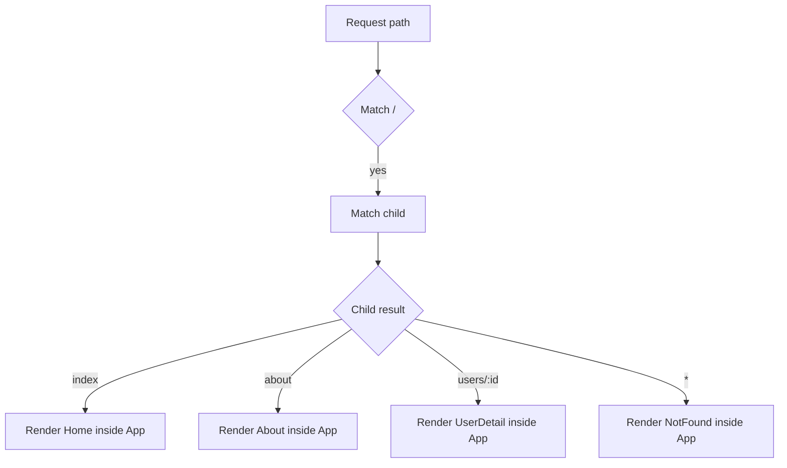

# Multi-Page Routing

Configure a multi-page SPA entirely from `spa.config.json`.

## Config

```json
{
  "page_title": "My App",
  "server": { "host": "127.0.0.1", "port": 8000 },
  "router": {
    "routes": [
      {
        "path": "/",
        "component": "App",
        "children": [
          { "index": true,         "component": "Home" },
          { "path": "about",       "component": "About" },
          { "path": "users",       "component": "UserList" },
          { "path": "users/:id",   "component": "UserDetail" },
          { "path": "*",           "component": "NotFound" }
        ]
      }
    ]
  }
}
```

## Route resolution



## Layout component (`App.lspa`)

```html
@import Nav from './Nav/Nav.lspa'

<python>
class App(Component):
    pass
</python>

<template>
  <div class="layout">
    <Nav />
    <main class="layout__content">
      {{ children }}
    </main>
  </div>
</template>
```

## Child component with params

`components/UserDetail/UserDetail.lspa`

```html
<python>
class UserDetail(Component):
    def context(self, props):
        return {"user_id": props.get("id", "unknown")}
</python>

<template>
  <div class="user-detail">
    <h1>User {{ py.user_id }}</h1>
  </div>
</template>
```

The router automatically passes `:id` as a prop.
