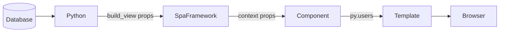

# Server-Seeded Data

Inject Python data (database results, API calls) into a component via `context()` and `initial_props`.

## Pattern



## Python side

```python
# app.py or FastAPI route
from lua_spa.app import create_default_framework
import json

framework = create_default_framework()

users = [
    {"id": 1, "name": "Alice"},
    {"id": 2, "name": "Bob"},
]

html = framework.build_view(props={"users": json.dumps(users)})
```

## Component

`components/UserList/UserList.lspa`

```html
<python>
import json

class UserList(Component):
    def context(self, props):
        raw = props.get("users", "[]")
        users = json.loads(raw) if isinstance(raw, str) else raw
        return {"users": users}
</python>

<template>
  <ul class="user-list">
    <li i-for="user in py.users" class="user-list__item">
      #{{ user.id }} — {{ user.name }}
    </li>
  </ul>
</template>
```

## Accessing `py` vs `props`

| Variable | Server | Client |
|---|---|---|
| `py.users` | ✅ (from `context()`) | ❌ (server only) |
| `props.users` | ✅ (raw string) | ✅ (available) |
| `state.*` | ❌ | ✅ |

For data that only needs to render once (no client mutation), use `py`. For data the client needs to react to, seed a `StateField` from a prop.
