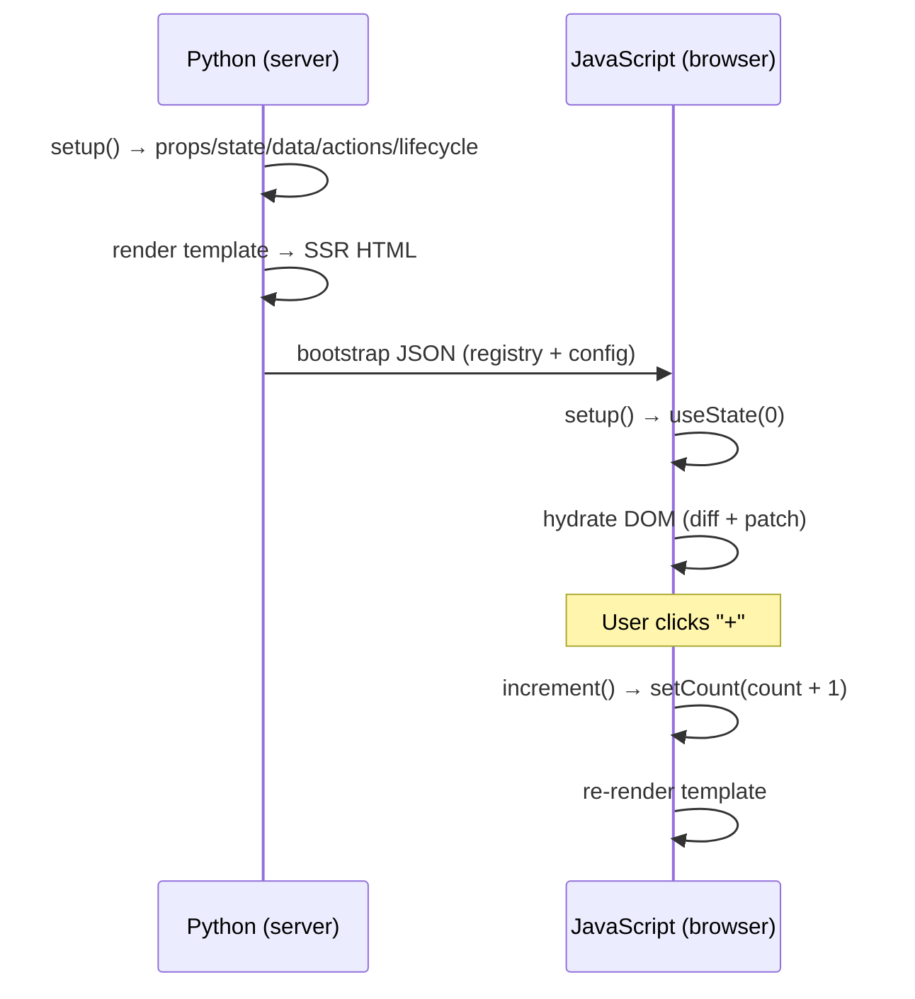

# Your First Component

Let's build a click counter — the "Hello World" of reactive UIs.

## Create the file

`components/Counter/Counter.lspa`

```html
<python>
class Counter(Component):
  def setup(self, props):
    state = {"count": 0}

    def increment():
      state["count"] += 1

    def decrement():
      state["count"] -= 1

    def reset():
      state["count"] = 0

        return {
      "props": {"label": "clicks", **props},
      "state": state,
      "data": {},
            "actions": {
        "increment": increment,
        "decrement": decrement,
        "reset": reset,
            },
      "lifecycle": {},
        }
</python>

<template>
  <div class="counter">
    <p>{{ state.count }} {{ props.label }}</p>
    <button @click="increment">+</button>
    <button @click="decrement">-</button>
    <button @click="reset">Reset</button>
  </div>
</template>
```

## Import it in `App.lspa`

```html
@import Counter from './Counter/Counter.lspa'

<python>
class App(Component):
    pass
</python>

<template>
  <div class="page">
    <Counter label="taps" />
  </div>
</template>
```

## How it works



## Key concepts introduced

| Concept | What it does |
|---|---|
| `setup(self, props)` | Declares props, state, data, actions and lifecycle |
| `state.count` | Reads reactive state in the template |
| `@click="action"` | Binds a DOM event to an action |
| callable action | Can mutate state and optionally return props patch |
