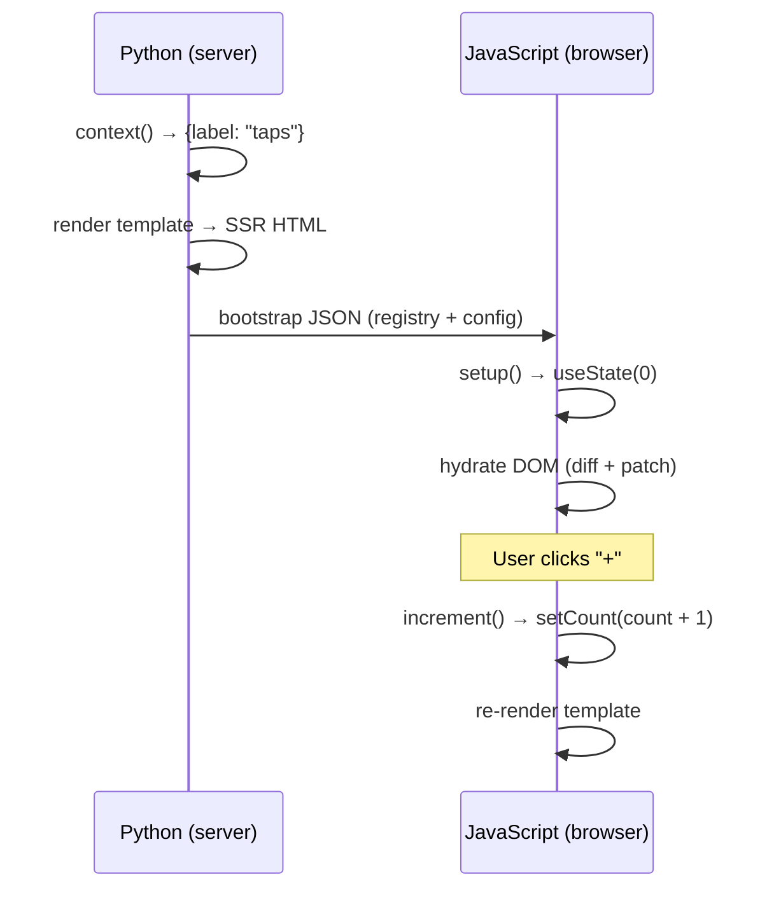

# Your First Component

Let's build a click counter — the "Hello World" of reactive UIs.

## Create the file

`components/Counter/Counter.lspa`

```html
<python>
class Counter(Component):
    def context(self, props):
        return {"label": props.get("label", "clicks")}

    def client(self):
        return {
            "state": {"count": 0},
            "actions": {
                "increment": self.add("count"),
                "decrement": self.sub("count"),
                "reset":     self.set("count", 0),
            },
        }
</python>

<template>
  <div class="counter">
    <p>{{ state.count }} {{ label }}</p>
    <button @click="increment">+</button>
    <button @click="decrement">-</button>
    <button @click="reset">Reset</button>
  </div>
</template>
```

## Import it in `App.lspa`

```html
@import Counter from './Counter/Counter.lspa'

<python>
class App(Component):
    pass
</python>

<template>
  <div class="page">
    <Counter label="taps" />
  </div>
</template>
```

## How it works



## Key concepts introduced

| Concept | What it does |
|---|---|
| `context(props)` | Provides server-side template variables |
| `client()` | Declares reactive state + actions for the browser |
| `state.count` | Reads reactive state in the template |
| `@click="action"` | Binds a DOM event to an action |
| `self.add("count")` | Returns an `{op: "add", state: "count"}` operation |
