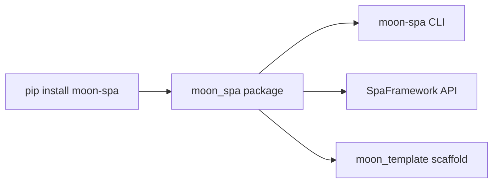

# Installation

moon-spa requires **Python 3.10+**.

## Install via pip

```bash
pip install moon-spa
```

## Verify

```bash
moon-spa --help
```

Expected output:

```
usage: moon-spa [-h] {serve,create} ...
```

## Optional: VS Code extension

Install the LSPA extension for syntax highlighting and editor support:

- [LSPA extension for VS Code](https://marketplace.visualstudio.com/items?itemName=roderiano.moon-spa-extension)

## Optional: virtual environment

```bash
python -m venv .venv
source .venv/bin/activate   # Windows: .venv\Scripts\activate
pip install moon-spa
```

## What gets installed



The package ships with:
- **`moon-spa` CLI** — `create` and `serve` commands
- **`SpaFramework`** — the Python API
- **`moon_template/`** — a starter project copied when you run `moon-spa create`
