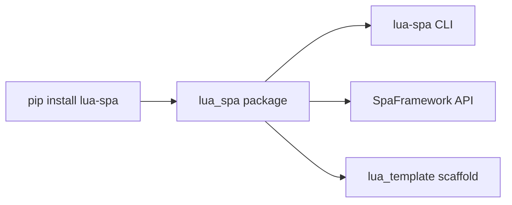

# Installation

lua-spa requires **Python 3.10+**.

## Install via pip

```bash
pip install lua-spa
```

## Verify

```bash
lua-spa --help
```

Expected output:

```
usage: lua-spa [-h] {serve,create} ...
```

## Optional: virtual environment

```bash
python -m venv .venv
source .venv/bin/activate   # Windows: .venv\Scripts\activate
pip install lua-spa
```

## What gets installed



The package ships with:
- **`lua-spa` CLI** — `create` and `serve` commands
- **`SpaFramework`** — the Python API
- **`lua_template/`** — a starter project copied when you run `lua-spa create`
