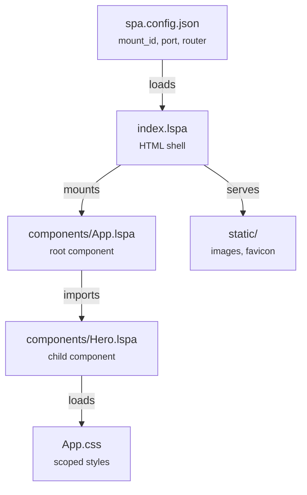

# Project Structure

A moon-spa project created with `moon-spa create my_app` looks like this:

```
my_app/
├── index.lspa           ← HTML shell (root page)
├── spa.config.json      ← app config (title, mount, port, router)
├── index.css            ← global styles
├── components/          ← all .lspa components live here
│   ├── App.lspa
│   ├── App.css
│   └── ...
└── static/              ← static assets (images, icons)
    └── logo.png
```

## File roles



### `index.lspa`

The HTML shell. moon-spa fills these placeholders at build time:

| Placeholder | Value |
|---|---|
| `{{ SPA_PAGE_TITLE }}` | `page_title` from config |
| `{{ SPA_MOUNT_ID }}` | `mount_id` from config (default `app`) |
| `{{ SPA_OUTLET }}` | Server-rendered HTML of the entry component |
| `{{ SPA_BOOTSTRAP }}` | Component registry JSON + runtime JS |

### `spa.config.json`

```json
{
  "page_title": "my_app",
  "initial_props": {},
  "server": {
    "host": "127.0.0.1",
    "port": 8000
  }
}
```

Optional fields: `mount_id`, `router`.

### `components/`

Every `.lspa` file is a component. Each file contains up to three sections:

```
@import Child from './Child/Child.lspa'

<python>
  ... server + client logic
</python>

<style src="./App.css"></style>

<template>
  ... HTML with {{ }} and directives
</template>
```

### `static/`

Static assets are served at `/static/<filename>`. Reference them in templates as `src="/static/logo.png"`.
