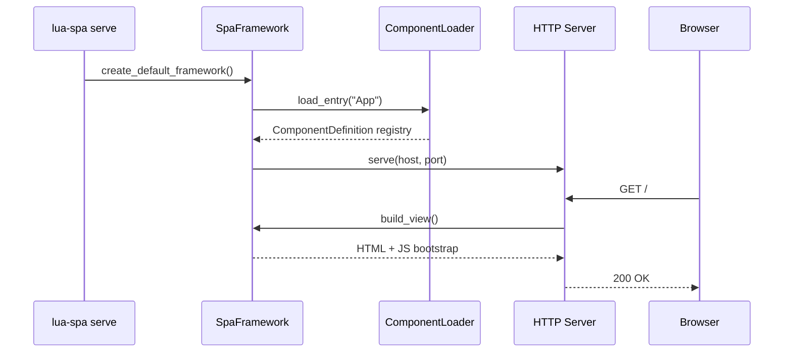

# Quick Start

From zero to a running SPA in under 5 minutes.

## 1. Create a project

```bash
lua-spa create my_app
cd my_app
```

This copies the built-in `lua_template` scaffold into `./my_app/`.

## 2. Run the dev server

```bash
lua-spa serve
```

Open [http://127.0.0.1:8000](http://127.0.0.1:8000).

## 3. Live reload

```bash
lua-spa serve --reload
```

The server watches `.lspa`, `.py`, `.css`, and `.js` files. The browser refreshes automatically when any file changes.

## What happens on `serve`


