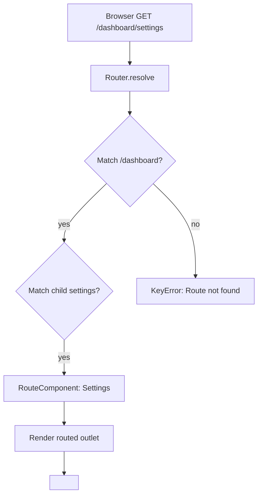

# Routing

lua-spa has a built-in router configured entirely in `spa.config.json`. No extra code needed.

## Basic setup

```json
{
  "page_title": "my_app",
  "router": {
    "routes": [
      { "path": "/",       "component": "Home" },
      { "path": "/about",  "component": "About" },
      { "path": "/users/:id", "component": "UserDetail" }
    ]
  }
}
```

With routing enabled, rendering is driven by `router.routes`.

When `"initial_path": "/"`, lua-spa starts from the route that matches `"/"`.

Example layout route:

```html
{
  "path": "/",
  "component": "Layout",
  "children": [
    { "index": true, "component": "DashboardHome" }
  ]
}
```

## Route parameters

Dynamic segments start with `:`. The value is passed as a prop to the component:

```html
<template>
  <h1>User {{ props.id }}</h1>
</template>
```

## Nested routes

```json
{
  "initial_path": "/",
  "routes": [
    {
      "path": "/dashboard",
      "children": [
        { "index": true, "component": "DashboardHome" },
        { "path": "settings", "component": "Settings" }
      ]
    }
  ]
}
```

## Route resolution flow



## Wildcard / fallback

```json
{ "path": "*", "component": "NotFound" }
```

Recommended usage (as last child route):

```json
{
  "path": "/",
  "children": [
    { "index": true, "component": "Dashboard" },
    { "path": "products", "component": "ProductList" },
    { "path": "*", "component": "NotFound" }
  ]
}
```

## Guard (meta)

Routes support arbitrary `meta` and a `guard` field for future middleware hooks:

```json
{
  "path": "/admin",
  "component": "Admin",
  "guard": "auth",
  "meta": { "requiresAuth": true }
}
```
