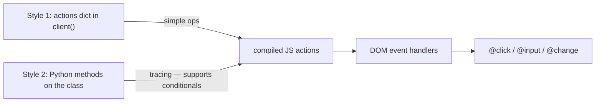
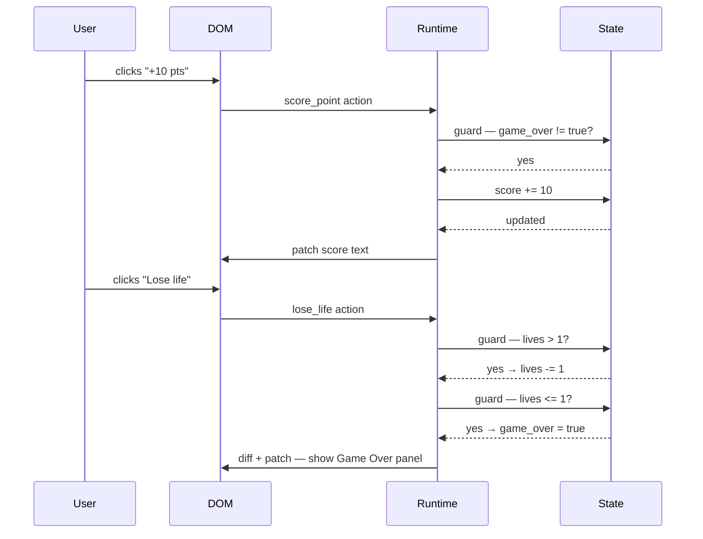

# Actions

Actions are the **only** way to mutate state in lua-spa. They are defined in Python and compiled to JavaScript automatically — no JS code needed.

## Two ways to declare actions



---

## Style 1 — `actions` dict inside `client()`

Return an `"actions"` key whose values are operation calls (`self.add`, `self.set`, etc.):

```python
class Counter(Component):
    def client(self):
        return {
            "state": {
                "count": 0,
            },
            "actions": {
                "increment": self.add("count"),
                "decrement": self.sub("count"),
                "reset":     self.set("count", 0),
                "flip":      self.toggle("visible"),
                "addFive":   self.add("count", 5),
            },
        }
```

Bind actions to DOM events with `@event="actionName"`:

```html
<template>
  <div class="counter">
    <p>{{ state.count }}</p>
    <button @click="decrement">−</button>
    <button @click="reset">0</button>
    <button @click="increment">+</button>
    <button @click="addFive">+5</button>
  </div>
</template>
```

---

## Style 2 — Python methods on the class (inferred)

Define public methods directly on the component class. The framework **traces** their execution
to produce JavaScript — this also enables **conditional logic** (see below).

```python
class Cart(Component):
    def client(self):
        return {
            "state": {
                "quantity":    0,
                "checked_out": False,
            },
        }

    def add_item(self):
        self.state.quantity += 1

    def remove_item(self):
        self.state.quantity -= 1

    def checkout(self):
        self.state.checked_out = True

    def clear(self):
        self.state.quantity    = 0
        self.state.checked_out = False
```

```html
<template>
  <div class="cart">
    <p>Items: {{ state.quantity }}</p>

    <div l-if="state.checked_out">
      <p>Order placed!</p>
      <button @click="clear">Start over</button>
    </div>

    <div l-else>
      <button @click="remove_item">−</button>
      <button @click="add_item">+</button>
      <button @click="checkout">Checkout</button>
    </div>
  </div>
</template>
```

### State mutation syntax in method actions

| Python | Effect |
|--------|--------|
| `self.state.x += n` | add `n` to `x` |
| `self.state.x -= n` | subtract `n` from `x` |
| `self.state.x = value` | set `x` to `value` |
| `self.state.flag = True/False` | set boolean |

> Methods whose names are reserved (`context`, `client`, `state`, `props`, `actions`,
> `methods`, `lifecycle`) or lifecycle hooks (`on_mount`, `on_create`, etc.) are **excluded**
> from inference automatically.

---

## Conditional actions

Method-style actions support `if` guards. The framework **traces** the comparison against
`self.state` and attaches it as a client-side guard — the operation only runs when the
condition is true at the moment of the click.

### Clamped counter (don't exceed a limit)

```python
class ClampedCounter(Component):
    def client(self):
        return {
            "state": {
                "count": 0,
            },
        }

    def increment(self):
        if self.state.count < 10:   # guard — only run if count < 10
            self.state.count += 1

    def decrement(self):
        if self.state.count > 0:    # prevent going negative
            self.state.count -= 1

    def reset(self):
        self.state.count = 0        # no condition — always runs
```

```html
<template>
  <div class="counter">
    <button @click="decrement">−</button>
    <span>{{ state.count }} / 10</span>
    <button @click="increment">+</button>
    <button @click="reset">Reset</button>
  </div>
</template>
```

### Supported comparison operators

| Python | JS guard generated |
|--------|--------------------|
| `self.state.x < n`  | `if (x < n) { ... }` |
| `self.state.x <= n` | `if (x <= n) { ... }` |
| `self.state.x > n`  | `if (x > n) { ... }` |
| `self.state.x >= n` | `if (x >= n) { ... }` |
| `self.state.x == n` | `if (x == n) { ... }` |
| `self.state.x != n` | `if (x != n) { ... }` |

### Guard on a multi-step action

Each step can carry its own independent guard:

```python
class PasswordInput(Component):
    def client(self):
        return {
            "state": {
                "attempts":  0,
                "locked":    False,
                "submitted": False,
            },
        }

    def submit(self):
        # Only record submission if not locked
        if self.state.locked != True:
            self.state.submitted = True

    def fail(self):
        self.state.attempts += 1
        # Lock after 3 failed attempts
        if self.state.attempts >= 3:
            self.state.locked = True
```

```html
<template>
  <div class="login">
    <div l-if="state.locked">
      <p>Account locked. Too many attempts.</p>
    </div>

    <div l-else>
      <p>Attempts: {{ state.attempts }} / 3</p>
      <button @click="submit">Login</button>
      <button @click="fail">Wrong password (demo)</button>
    </div>
  </div>
</template>
```

---

## Comparing the two styles

| | Style 1 (dict) | Style 2 (methods) |
|---|---|---|
| Where actions are declared | inside `client()` | as class methods |
| State mutation syntax | `self.add()`, `self.set()`, … | `self.state.x += n`, `self.state.x = v` |
| Conditionals | ❌ not supported | ✅ `if self.state.x < n:` |
| Multi-operation actions | ✅ return a list | ✅ multiple assignments |
| Best for | simple, few actions | guards, complex logic |

You can **mix both** — dict actions and method actions coexist in the same component:

```python
class Mixed(Component):
    def client(self):
        return {
            "state": {"count": 0, "flag": False},
            "actions": {
                "reset": self.set("count", 0),   # dict-style — no condition needed
            },
        }

    def safe_increment(self):          # method-style — conditional
        if self.state.count < 100:
            self.state.count += 1

    def toggle_flag(self):
        self.state.flag = not self.state.flag  # or: self.toggle("flag") in dict style
```

---

## Full example: scoreboard with guarded actions

```python
class Scoreboard(Component):
    def client(self):
        return {
            "state": {
                "score":     0,
                "lives":     3,
                "game_over": False,
            },
        }

    def score_point(self):
        # Only score if the game is still running
        if self.state.game_over != True:
            self.state.score += 10

    def lose_life(self):
        if self.state.lives > 1:
            self.state.lives -= 1   # still have lives left
        if self.state.lives <= 1:
            self.state.game_over = True   # last life → game over

    def restart(self):
        self.state.score     = 0
        self.state.lives     = 3
        self.state.game_over = False
```

```html
<template>
  <div class="scoreboard">
    <p>Score: {{ state.score }}</p>
    <p>Lives: {{ state.lives }}</p>

    <div l-if="state.game_over">
      <p>Game Over</p>
      <button @click="restart">Play again</button>
    </div>

    <div l-else>
      <button @click="score_point">+10 pts</button>
      <button @click="lose_life">Lose life</button>
    </div>
  </div>
</template>
```


