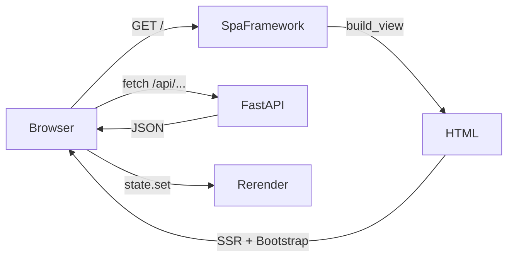

# Backend Integration

lua-spa is a Python framework. Its HTTP server is intentionally minimal — but you can embed it inside a larger Python application or replace the server entirely.

## Using `SpaFramework` directly

```python
from pathlib import Path
from lua_spa.framework import SpaFramework

framework = SpaFramework(
    view_file=Path("my_app/index.lspa"),
    components_dir=Path("my_app/components"),
    static_dir=Path("my_app/static"),
    page_title="My App",
    port=8080,
)
framework.serve(reload=True)
```

## Generating HTML without serving

`build_view()` returns a plain string — no server required:

```python
html = framework.build_view(props={"user": "alice"})
# Write to a file, return from another web framework, etc.
with open("dist/index.html", "w") as f:
    f.write(html)
```

## Embedding in Flask / FastAPI

```python
from fastapi import FastAPI
from fastapi.responses import HTMLResponse
from lua_spa.app import create_default_framework

api = FastAPI()
spa = create_default_framework()

@api.get("/")
def serve_spa():
    return HTMLResponse(spa.build_view())

@api.get("/api/data")
def get_data():
    return {"hello": "world"}
```

## Architecture with external backend



## Passing server data to components

Use `build_view(props={...})` to inject server-side data at render time:

```python
user = db.get_user(session["user_id"])
html = framework.build_view(props={"username": user.name, "role": user.role})
```

The props flow into `context(props)` on the server and into `resolvedProps` on the client.
