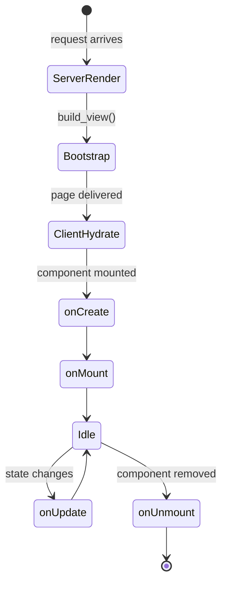

# Components

A component is a `.lspa` file that combines HTML template, Python logic, and CSS styles in one place.

## Anatomy of a `.lspa` file

```
@import Child from './Child/Child.lspa'   ← optional imports

<python>                                   ← optional Python block
  ...
</python>

<style src="./MyComponent.css"></style>    ← optional CSS (inlined at build time)

<template>                                 ← required HTML template
  ...
</template>
```

## The three sections

```mermaid
graph LR
    A["@import"] --> B[Component registry]
  C["&lt;python&gt;"] --> D[setup(props) spec]
    E["&lt;template&gt;"] --> F[HTML rendered server-side]
    F --> G[Hydrated client-side]
```

### `@import`

Registers another `.lspa` file as a child component:

```html
@import Hero from './Hero/Hero.lspa'
```

Use the registered name as a tag inside `<template>`:

```html
<template>
  <Hero title="Welcome" />
</template>
```

### `<python>` block

Components use one contract:

| Function | Purpose | Runs on |
|---|---|---|
| `setup(self, props)` | Returns `props/state/data/actions/lifecycle` mapping | Server + compiled client runtime |

```python
class MyComponent(Component):
  def setup(self, props):
    state = {"visible": True}

    def toggle():
      state["visible"] = not state["visible"]

        return {
      "props": {"name": "World", **props},
      "state": state,
      "data": {"greeting": f"Hello, {props.get('name', 'World')}"},
      "actions": {"toggle": toggle},
      "lifecycle": {},
        }
```

### `<template>` block

Standard HTML enriched with:
- `{{ expression }}` — interpolation
- `l-if` / `l-else-if` / `l-else` — conditionals
- `i-for` — loops
- `@event="action"` — event bindings
- `:attr="expr"` — dynamic attributes

## Component lifecycle



## Restrictions

- No `<script>` tags — use `<python>` + `setup(self, props)` instead.
- CSS must be in an external file referenced via `<style src="...">` or inline `<style>` blocks.
