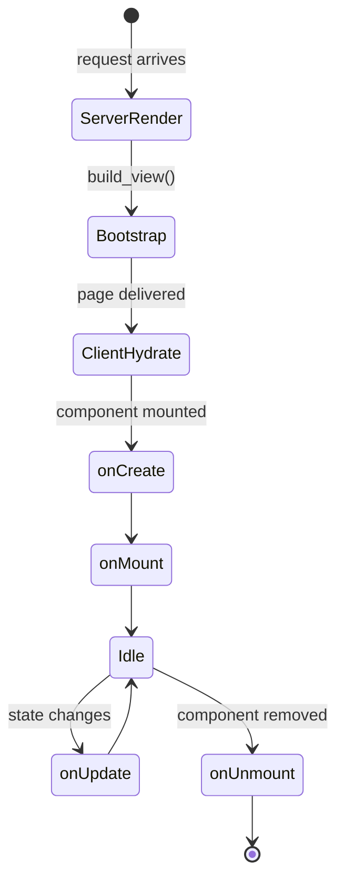

# Components

A component is a `.lspa` file that combines HTML template, Python logic, and CSS styles in one place.

## Anatomy of a `.lspa` file

```
@import Child from './Child/Child.lspa'   ← optional imports

<python>                                   ← optional Python block
  ...
</python>

<style src="./MyComponent.css"></style>    ← optional CSS (inlined at build time)

<template>                                 ← required HTML template
  ...
</template>
```

## The three sections

```mermaid
<<<<<<< HEAD
flowchart LR
    A["@import"] --> B["Component registry"]
    C["python block"] --> D["setup(self, props)"]
    E["template block"] --> F["SSR HTML"]
    B --> F
    D --> F
    F --> G["Hydrated client-side"]
=======
graph LR
    A["@import"] --> B[Component registry]
  C["&lt;python&gt;"] --> D[setup(props) spec]
    E["&lt;template&gt;"] --> F[HTML rendered server-side]
    F --> G[Hydrated client-side]
>>>>>>> 2c799f42bc20779e2fb5f6ae646ad11046eee552
```

### `@import`

Registers another `.lspa` file as a child component:

```html
@import Hero from './Hero/Hero.lspa'
```

Use the registered name as a tag inside `<template>`:

```html
<template>
  <Hero title="Welcome" />
</template>
```

### `<python>` block

Components use one contract:

| Function | Purpose | Runs on |
|---|---|---|
| `setup(self, props)` | Defines `props/state/data/actions/lifecycle` (return mapping or let server infer automatically) | Server + compiled client runtime |

```python
class MyComponent(Component):
  def setup(self, props):
    props = {"name": "World", **props}
    state = {"visible": True}
    data = {"greeting": f"Hello, {props.get('name', 'World')}"}

    def toggle():
      state["visible"] = not state["visible"]

    def mounted():
      toggle()
```

When `setup` does not return a mapping, the server builds it automatically using:
- Local variables: `props`, `state`, `data`
- Local functions inferred as `actions`
- Lifecycle-named functions (`mounted`, `created`, `on_mount`, etc.) inferred as `lifecycle`

Inside action/lifecycle callables, mutating `data` is enough to patch props on the client.
You no longer need to `return {"key": value}` just to sync computed data.

Latest behavior:
- `setup` may omit both `return` and `self.actions/self.lifecycle` assignments.
- Server infers `actions` from local callables and `lifecycle` from lifecycle-named callables.

### `<template>` block

Standard HTML enriched with:
- `{{ expression }}` — interpolation
- `l-if` / `l-else-if` / `l-else` — conditionals
- `i-for` — loops
- `@event="action"` — event bindings
- `:attr="expr"` — dynamic attributes

## Component lifecycle



## Restrictions

- No `<script>` tags — use `<python>` + `setup(self, props)` instead.
- CSS must be in an external file referenced via `<style src="...">` or inline `<style>` blocks.
