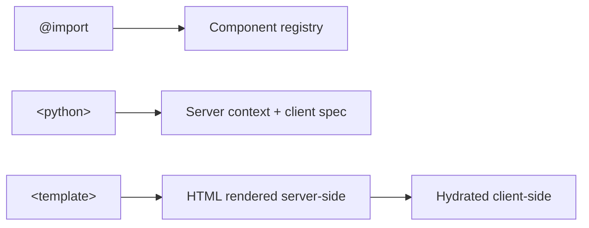
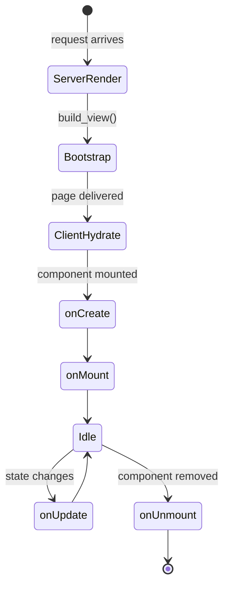

# Components

A component is a `.lspa` file that combines HTML template, Python logic, and CSS styles in one place.

## Anatomy of a `.lspa` file

```
@import Child from './Child/Child.lspa'   ← optional imports

<python>                                   ← optional Python block
  ...
</python>

<style src="./MyComponent.css"></style>    ← optional CSS (inlined at build time)

<template>                                 ← required HTML template
  ...
</template>
```

## The three sections



### `@import`

Registers another `.lspa` file as a child component:

```html
@import Hero from './Hero/Hero.lspa'
```

Use the registered name as a tag inside `<template>`:

```html
<template>
  <Hero title="Welcome" />
</template>
```

### `<python>` block

Two functions live here:

| Function | Purpose | Runs on |
|---|---|---|
| `context(props)` | Returns a dict of template variables | Server |
| `client()` | Declares state, actions, lifecycle | Both (compiled to JS) |

```python
class MyComponent(Component):
    def context(self, props):
        return {"greeting": f"Hello, {props.get('name', 'World')}"}

    def client(self):
        return {
            "props":   {"name": "World"},
            "state":   {"visible": True},
            "actions": {"toggle": self.toggle("visible")},
        }
```

### `<template>` block

Standard HTML enriched with:
- `{{ expression }}` — interpolation
- `l-if` / `l-else-if` / `l-else` — conditionals
- `i-for` — loops
- `@event="action"` — event bindings
- `:attr="expr"` — dynamic attributes

## Component lifecycle



## Restrictions

- No `<script>` tags — use `<python>` + `client()` instead.
- CSS must be in an external file referenced via `<style src="...">` or inline `<style>` blocks.
