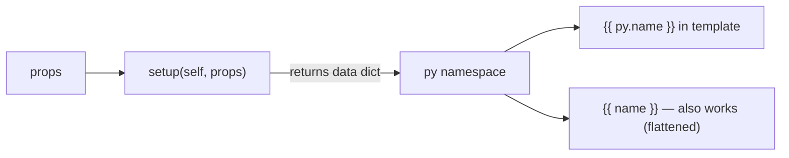

# Computed Variables

Computed variables let you derive values from props (or any Python logic) on the server side, making them available in your template as the `py` namespace.

They are declared in `setup(self, props)` via the `data` field.



---

## Declaring computed variables

Return a plain dict in `data` from `setup(self, props)`. Every key becomes a variable you can use in the template:

```python
class Greeting(Component):
  def setup(self, props):
        name = props.get("name", "World")
    data = {
      "message":    f"Hello, {name}!",
      "upper_name": name.upper(),
      "char_count": len(name),
    }
        return {
      "props": {"name": name, **props},
      "state": {},
      "data": data,
      "actions": {},
      "lifecycle": {},
        }
```

```html
<template>
  <div>
    <h1>{{ py.message }}</h1>
    <p>Name in caps: {{ upper_name }}</p>
    <small>{{ char_count }} characters</small>
  </div>
</template>
```

`py.message` and `message` are equivalent — values are available both ways.

---

## What you can do inside `setup()`

`setup(self, props)` is plain Python. You can call any function, import libraries,
format strings, run conditionals, compute lists — anything:

```python
from datetime import date

class InvoiceHeader(Component):
  def setup(self, props):
        total   = props.get("subtotal", 0) * 1.2          # add 20% tax
        due     = props.get("due_date", str(date.today()))
        overdue = due < str(date.today())

    data = {
      "total_with_tax": f"${total:.2f}",
      "due_label":      f"Due: {due}",
      "status":         "OVERDUE" if overdue else "Pending",
      "status_class":   "danger"  if overdue else "info",
    }

        return {
      "props": props,
      "state": {},
      "data": data,
      "actions": {},
      "lifecycle": {},
        }
```

```html
<template>
  <div class="invoice-header">
    <span class="{{ status_class }}">{{ py.status }}</span>
    <p>{{ py.total_with_tax }}</p>
    <p>{{ py.due_label }}</p>
  </div>
</template>
```

---

## Combining computed data with actions/state

`setup().data` provides server-side computed values in `py`.  
`setup().state` and `setup().actions` provide client-side reactive behavior.

Both can coexist in the same component:

```python
class ProductCard(Component):
  def setup(self, props):
        price    = props.get("price", 0)
        discount = props.get("discount", 0)
        final    = price * (1 - discount / 100)
    data = {
            "display_price":    f"${price:.2f}",
            "display_final":    f"${final:.2f}",
            "discount_label":   f"{discount}% off" if discount else "",
            "has_discount":     discount > 0,
        }
    state = {
      "quantity": 1,
      "in_cart": False,
    }

    def add():
      state["quantity"] += 1

    def remove():
      state["quantity"] -= 1

    def to_cart():
      state["in_cart"] = True

        return {
      "props": props,
      "state": state,
      "data": data,
            "actions": {
        "add": add,
        "remove": remove,
        "to_cart": to_cart,
            },
      "lifecycle": {},
        }
```

```html
<template>
  <div class="product-card">
    <p l-if="py.has_discount" class="tag">{{ py.discount_label }}</p>
    <p><s>{{ py.display_price }}</s> → <strong>{{ py.display_final }}</strong></p>

    <div class="qty">
      <button @click="remove">−</button>
      <span>{{ state.quantity }}</span>
      <button @click="add">+</button>
    </div>

    <button @click="to_cart" l-if="!state.in_cart">Add to cart</button>
    <span l-else>✓ In cart</span>
  </div>
</template>
```

`py.*` values are baked into the initial HTML and can be refreshed by server call patches.  
`state.*` values are reactive and update live in the browser.

---

## Returning object-like data

If `setup().data` is object-like, public attributes (no leading `_`) are extracted:

```python
class Summary(Component):
  def setup(self, props):
        class Info:
            label  = props.get("label", "n/a").title()
            count  = len(props.get("items", []))
            plural = "s" if count != 1 else ""

    return {
      "props": props,
      "state": {},
      "data": Info(),
      "actions": {},
      "lifecycle": {},
    }
```

```html
<template>
  <p>{{ py.label }}: {{ py.count }} item{{ py.plural }}</p>
</template>
```

---

## Limitations

| | `setup().data` — `py` namespace | `setup().state` |
|---|---|---|
| When evaluated | server-side render + server callable patches | client-side reactive |
| Reacts to user input | via server-call actions/lifecycle | ✅ |
| Can run Python / import libs | ✅ | ❌ |
| Available in template | ✅ as `{{ py.x }}` or `{{ x }}` | ✅ as `{{ state.x }}` |
| Survives browser navigation | ❌ re-evaluated on next request | ✅ lives in JS memory |

Because computed variables are server-side, they are ideal for:
- Formatting values derived from props (prices, dates, labels)
- Pre-computing lists or lookup tables
- Conditional classes or status strings
- Any logic that requires Python libraries unavailable in the browser
