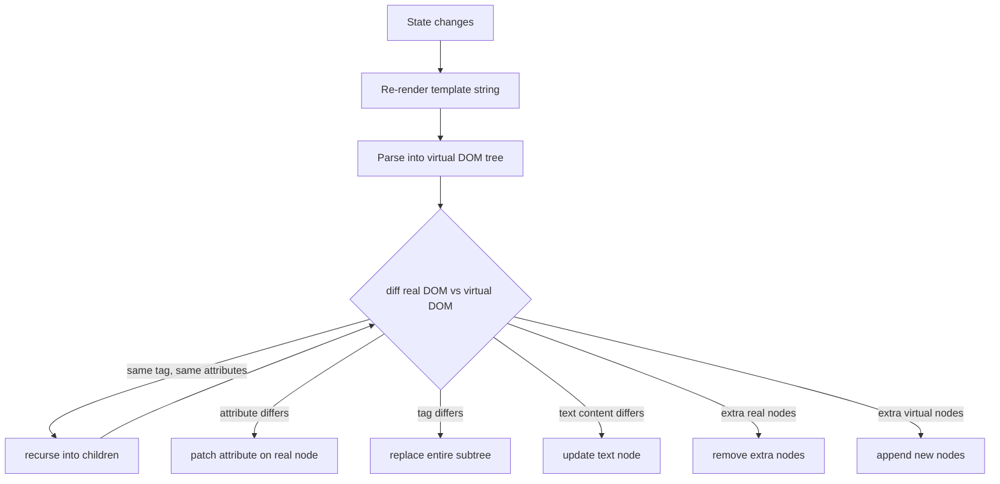

# DOM Diffing

moon-spa includes a lightweight DOM diffing engine inspired by React's reconciler. It updates only the parts of the DOM that actually changed.

## Why diff?

Re-creating the entire DOM on every state update would:
- Lose form input focus and scroll position
- Cause unnecessary reflows and repaints
- Produce visible flicker

Diffing avoids all of this.

## Algorithm overview



## Node comparison rules

| Condition | Action |
|---|---|
| Both are text nodes, same content | skip |
| Both are text nodes, different content | update `textContent` |
| Both are elements, same tag + key | recurse into children |
| Elements have different tag | replace subtree |
| Attribute added or changed | set attribute |
| Attribute removed | remove attribute |
| Node count mismatch | add or remove trailing nodes |

## Ignorable whitespace

Pure whitespace text nodes between tags are ignored during diffing so that HTML formatting doesn't cause spurious patches.

## Event delegation

Event bindings (`@click`, `@input`, etc.) are re-attached after each diff pass to ensure handlers are always up-to-date.

## Key attribute

Use `key` on list items to give the differ a stable identity hint:

```html
<li i-for="item in state.items" :key="item.id">{{ item.name }}</li>
```

Without `key`, items are matched by position. With `key`, the differ can reorder without replacing DOM nodes.
