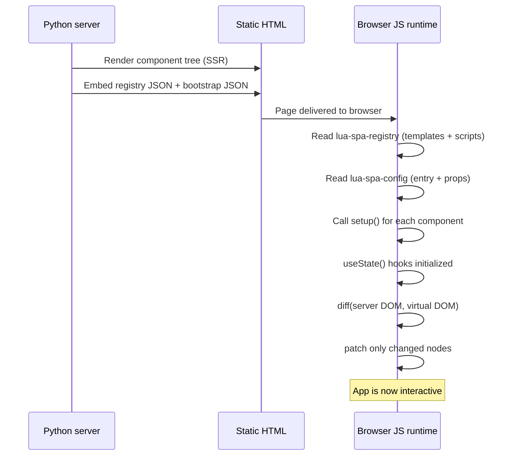

# Hydration

Hydration is the process of making server-rendered HTML interactive by attaching JavaScript state and event listeners.

## Overview

lua-spa uses a **Server-Side Render → Hydrate** model:



## What gets embedded

When `build_view()` runs, `{{ SPA_BOOTSTRAP }}` is replaced with:

```html
<script id="lua-spa-registry" type="application/json">
  { "App": { "template": "...", "script": "..." }, ... }
</script>
<script id="lua-spa-config" type="application/json">
  { "entry": "App", "mountId": "app", "props": {} }
</script>
<script>/* SPA_RUNTIME_JS */</script>
```

## Component registry

Each entry in the registry contains:
- `template` — the raw HTML template string (with `{{ }}` and directives intact for client re-use)
- `script` — the compiled `setup()` JavaScript function generated from `Component.setup(self, props)`

## Hydration strategy

The runtime does **not** discard the server HTML. Instead:

1. It walks the existing DOM.
2. It builds a virtual representation from the template + current state.
3. It **diffs** and **patches** only the nodes that differ.

This means the first paint is instant (SSR HTML), and JavaScript takes over seamlessly.

## useState hook

Inside the generated `setup()`:

```js
function setup({ useState, props, componentName }) {
  const [count, setCount] = useState(0);
  const actions = {
    increment: function () { setCount(count + 1); },
    reload: function () { __serverCall("action", "reload"); },
  };
  return { props, state: { count }, actions, lifecycle };
}
```

`useState` is the framework's own hook — it schedules a re-render when the setter is called.

For callable actions/lifecycle hooks, hydration uses `POST /__lua_spa_action` and applies state/props patches returned by the server.
