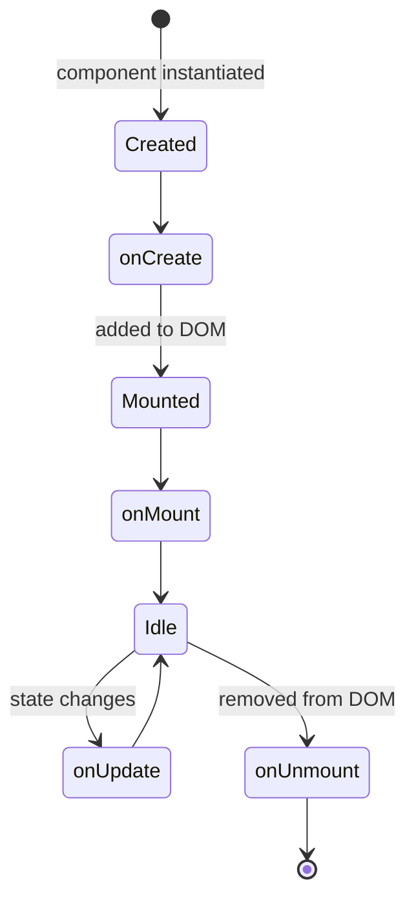

# Lifecycle Hooks

Lifecycle hooks let you run actions at specific points in a component's life.

## Available hooks

| Hook | When it fires |
|---|---|
| `onCreate` | Component created (before DOM mount) |
| `onMount` | Component added to the DOM |
| `onUpdate` | Any state update (re-render) |
| `onUnmount` | Component removed from the DOM |

## Lifecycle flow



---

## Declaring lifecycle in setup

Declare lifecycle entries inside the `lifecycle` mapping returned by `setup(self, props)`.

### Accepted method names

| Canonical hook | Accepted Python method names |
|---|---|
| `onCreate` | `on_create`, `onCreate`, `created` |
| `onMount` | `on_mount`, `onMount`, `mounted` |
| `onUpdate` | `on_update`, `onUpdate`, `updated` |
| `onUnmount` | `on_unmount`, `onUnmount`, `unmounted` |

### Example

```python
class Dashboard(Component):
    def setup(self, props):
        state = {
            "ready": False,
            "count": 0,
            "visible": True,
        }

        def increment():
            state["count"] += 1

        def mounted():
            state["ready"] = True

        return {
            "props": props,
            "state": state,
            "data": {},
            "actions": {"increment": increment},
            "lifecycle": {"mounted": mounted},
        }
```

```html
<template>
  <div l-if="state.ready" class="dashboard">
    <p>Re-renders: {{ state.count }}</p>
    <button @click="increment">+</button>
  </div>
  <div l-else>Initialising…</div>
</template>
```

Callable lifecycle hooks run on server through `server_call` and may call one or more actions.

---

Values can be action name strings, inline operation mappings, callables, or lists.

```python
def setup(self, props):
    return {
        "props": props,
        "state": {"ready": False, "count": 0},
        "data": {},
        "actions": {
            "markLoaded": {"op": "set", "state": "ready", "value": True},
            "increment":  {"op": "add", "state": "count", "value": 1},
        },
        "lifecycle": {
            "onMount":  ["markLoaded"],         # call a named action
            "onUpdate": [{"op": "add", "state": "count", "value": 1}],
        },
    }
```

---

## Canonical hook names

Supported hook names after normalization: `onCreate`, `onMount`, `onUpdate`, `onUnmount`.

Aliases like `created`, `mounted`, `updated`, `unmounted` are accepted.

```python
class Page(Component):
    def setup(self, props):
        return {
            "props": props,
            "state": {"loaded": False, "visits": 0},
            "data": {},
            "actions": {},
            "lifecycle": {
                "onMount": [{"op": "set", "state": "loaded", "value": True}],
                "onUpdate": [{"op": "add", "state": "visits", "value": 1}],
            },
        }
```

---

## Returning multiple operations

Both styles support returning a list of operations from a single hook:

```python
"lifecycle": {
    "onMount": [
        {"op": "set", "state": "ready", "value": True},
        {"op": "set", "state": "count", "value": 0},
        {"op": "add", "state": "visits", "value": 1},
    ]
}
```
