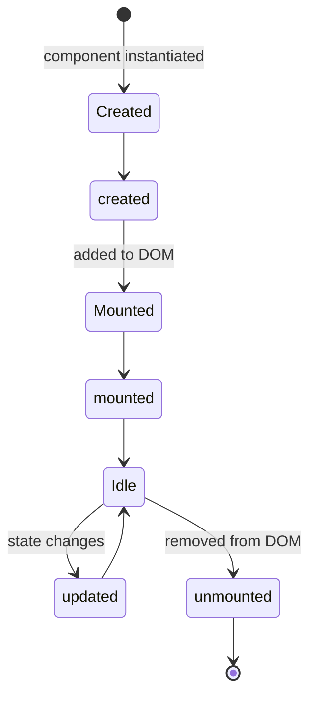

# Lifecycle Hooks

Lifecycle hooks let you run actions at specific points in a component's life.

## Available hooks

| Hook | When it fires |
|---|---|
| `created` | Component instance created (before first mount) |
| `mounted` | Component added to the DOM |
| `updated` | After any state-driven re-render |
| `unmounted` | Component removed from the DOM |

## Lifecycle flow



---

## Declaring lifecycle in setup

Declare lifecycle entries inside the `lifecycle` mapping returned by `setup(self, props)`.

### Supported method names

Only these four lifecycle names are supported:

- `created`
- `mounted`
- `updated`
- `unmounted`

### Example

```python
class Dashboard(Component):
    def setup(self, props):
        state = {
            "ready": False,
            "count": 0,
            "visible": True,
        }

        def increment():
            state["count"] += 1

        def mounted():
            state["ready"] = True

        def unmounted():
            state["ready"] = False

        # Optional: The server can infer this return automatically.
        return {
            "props": props,
            "state": state,
            "data": {},
            "actions": {"increment": increment},
            "lifecycle": {"mounted": mounted},
        }
```

```html
<template>
  <div l-if="state.ready" class="dashboard">
    <p>Re-renders: {{ state.count }}</p>
    <button @click="increment">+</button>
  </div>
  <div l-else>Initialising…</div>
</template>
```

Callable lifecycle hooks run on server through `server_call` and may call one or more actions.

---

Values can be action name strings, inline operation mappings, callables, or lists.

```python
def setup(self, props):
    return {
        "props": props,
        "state": {"ready": False, "count": 0},
        "data": {},
        "actions": {
            "markLoaded": {"op": "set", "state": "ready", "value": True},
            "increment":  {"op": "add", "state": "count", "value": 1},
        },
        "lifecycle": {
            "mounted": ["markLoaded"],         # call a named action
            "updated": [{"op": "add", "state": "count", "value": 1}],
        },
    }
```

---

## Hook naming rules

Use the lifecycle keys exactly as `created`, `mounted`, `updated`, and `unmounted`.
Legacy aliases such as `onMount` and `on_mount` are not supported.

```python
class Page(Component):
    def setup(self, props):
        # Optional: The server can infer this return automatically.
        return {
            "props": props,
            "state": {"loaded": False, "visits": 0},
            "data": {},
            "actions": {},
            "lifecycle": {
                "mounted": [{"op": "set", "state": "loaded", "value": True}],
                "updated": [{"op": "add", "state": "visits", "value": 1}],
            },
        }
```

---

## Returning multiple operations

Both styles support returning a list of operations from a single hook:

```python
"lifecycle": {
    "mounted": [
        {"op": "set", "state": "ready", "value": True},
        {"op": "set", "state": "count", "value": 0},
        {"op": "add", "state": "visits", "value": 1},
    ]
}
```
