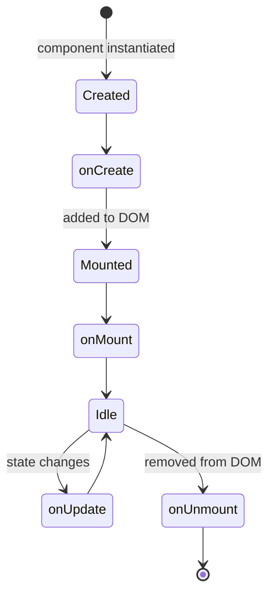

# Lifecycle Hooks

Lifecycle hooks let you run state operations at specific points in a component's life in the browser.

## Available hooks

| Hook | When it fires |
|---|---|
| `onCreate` | Component created (before DOM mount) |
| `onMount` | Component added to the DOM |
| `onUpdate` | Any state update (re-render) |
| `onUnmount` | Component removed from the DOM |

## Lifecycle flow



---

## Style 1 — direct Python methods (recommended)

Define methods directly on the component class using any of the accepted name variants. The framework detects them automatically and compiles them to the correct JS lifecycle hook.

### Accepted method names

| Canonical hook | Accepted Python method names |
|---|---|
| `onCreate` | `on_create`, `onCreate`, `created` |
| `onMount` | `on_mount`, `onMount`, `mounted` |
| `onUpdate` | `on_update`, `onUpdate`, `updated` |
| `onUnmount` | `on_unmount`, `onUnmount`, `unmounted` |

### Example

```python
class Dashboard(Component):
    def client(self):
        return {
            "state": {
                "ready":   False,
                "count":   0,
                "visible": True,
            },
            "actions": {
                "increment": self.add("count"),
            },
        }

    # Runs once, before the component is added to the DOM
    def on_create(self):
        return self.set("count", 0)

    # Runs once, right after the component is added to the DOM
    def on_mount(self):
        return self.set("ready", True)

    # Runs on every state update (re-render)
    def on_update(self):
        return self.add("count")   # track how many times it re-rendered

    # Runs when the component is removed from the DOM
    def on_unmount(self):
        return self.set("visible", False)
```

```html
<template>
  <div l-if="state.ready" class="dashboard">
    <p>Re-renders: {{ state.count }}</p>
    <button @click="increment">+</button>
  </div>
  <div l-else>Initialising…</div>
</template>
```

> Each lifecycle method returns a **single operation** (`self.add`, `self.set`, etc.) or a **list of operations** executed in order.

---

## Style 2 — `lifecycle` dict inside `client()`

If you prefer to keep everything inside `client()`, declare a `"lifecycle"` key. Values can be **action name strings** or **inline operation dicts**.

```python
def client(self):
    return {
        "state": {"ready": False, "count": 0},
        "actions": {
            "markLoaded": self.set("ready", True),
            "increment":  self.add("count"),
        },
        "lifecycle": {
            "onMount":  ["markLoaded"],         # call a named action
            "onUpdate": [self.add("count")],    # inline operation
        },
    }
```

---

## Combining both styles

You can mix method-based and dict-based hooks in the same component. Method-based hooks **override** dict-based ones for the same hook name:

```python
class Page(Component):
    def client(self):
        return {
            "state": {"loaded": False, "visits": 0},
            "lifecycle": {
                "onMount": [self.set("loaded", True)],  # dict-based
            },
        }

    def on_update(self):          # method-based — takes precedence for onUpdate
        return self.add("visits")
```

---

## Returning multiple operations

Both styles support returning a list of operations from a single hook:

```python
def on_mount(self):
    return [
        self.set("ready", True),
        self.set("count", 0),
        self.add("visits"),
    ]
```
