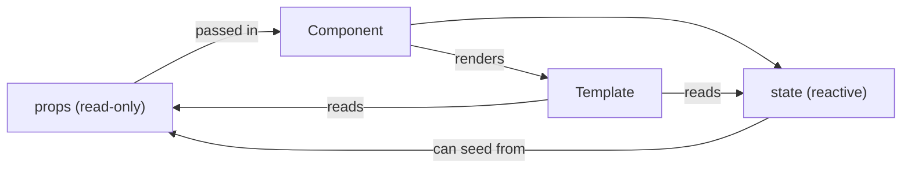

# Props

Props are values passed from a parent component (or the framework bootstrap) into a child component.

## Passing props

### From parent template

```html
<Card title="Hello" count="42" active="true" />
```

### From `spa.config.json`

```json
{
  "initial_props": { "user": "admin", "debug": false }
}
```

## Receiving props on the server

`context(props)` receives a plain Python dict:

```python
def context(self, props):
    title = props.get("title", "Default Title")
    return {"title": title}
```

Then use it in the template:

```html
<template>
  <h1>{{ title }}</h1>
</template>
```

## Declaring props on the client

List expected props with defaults inside `client()`:

```python
def client(self):
    return {
        "props": {
            "title": "Default Title",
            "count": 0,
            "active": False,
        }
    }
```

The framework coerces incoming string attributes to the correct type:
- `int` / `float` → `Number(...)`
- `bool` → `Boolean(...)`
- `str` → stays as-is

## Using props in templates

```html
<template>
  <p>{{ props.title }}</p>
  <p l-if="props.active">Active!</p>
</template>
```

## Props vs State



| | Props | State |
|---|---|---|
| Source | Parent / config | `client()` declaration |
| Mutability | Read-only | Mutable via actions |
| Scope | Server + client | Client only |
| Syntax | `props.x` | `state.x` |
