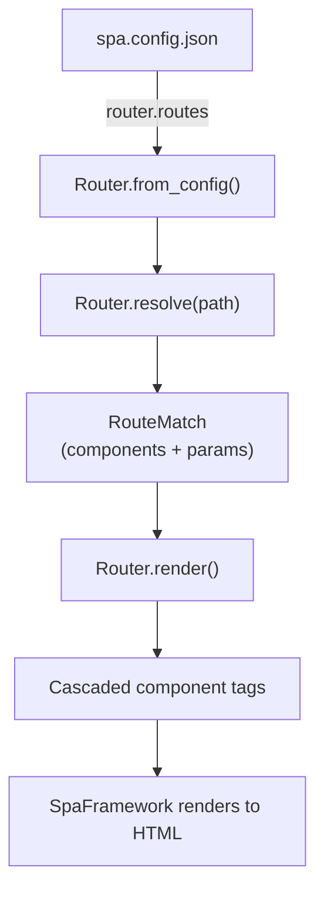
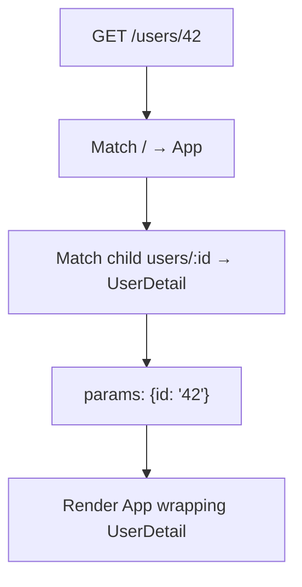
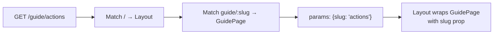

# Routing

The lua-spa router is configured entirely in `spa.config.json` — no code needed. It supports nested routes, dynamic parameters, index routes, wildcard fallbacks, and route guards.



---

## Basic setup

Add a `"router"` key to `spa.config.json`:

```json
{
  "page_title": "My App",
  "server": { "host": "127.0.0.1", "port": 8000 },
  "router": {
    "routes": [
      { "path": "/",      "component": "Home" },
      { "path": "/about", "component": "About" },
      { "path": "/blog",  "component": "Blog" }
    ]
  }
}
```

The `entry_component` key is not needed when `router` is present — the framework uses the router to resolve the initial path.

---

## Route parameters

Prefix a path segment with `:` to capture it as a prop:

```json
{ "path": "/users/:id",          "component": "UserDetail" },
{ "path": "/posts/:year/:month", "component": "PostArchive" }
```

The captured values are passed to the component as props and available in the template:

```html
<python>
class UserDetail(Component):
    def context(self, props):
        return {"user_id": props.get("id", "unknown")}
</python>

<template>
  <h1>User {{ py.user_id }}</h1>
</template>
```

Multiple params in one path:

```html
<python>
class PostArchive(Component):
    def context(self, props):
        return {
            "year":  props.get("year"),
            "month": props.get("month"),
        }
</python>

<template>
  <h2>Posts from {{ py.month }}/{{ py.year }}</h2>
</template>
```

---

## Nested routes

Use `"children"` to nest routes inside a layout component:

```json
{
  "router": {
    "routes": [
      {
        "path": "/",
        "component": "App",
        "children": [
          { "index": true,         "component": "Home" },
          { "path": "about",       "component": "About" },
          { "path": "users",       "component": "UserList" },
          { "path": "users/:id",   "component": "UserDetail" }
        ]
      }
    ]
  }
}
```

The router resolves the full stack — parent first, then child — and renders them as nested component tags:

```html
<!-- resolved for /users/42 -->
<App>
  <UserDetail __props="...id=42..." />
</App>
```

### Resolution flow



---

## Index routes

An `"index": true` route matches when the parent path is matched exactly (no extra segments):

```json
{
  "path": "/dashboard",
  "component": "Dashboard",
  "children": [
    { "index": true,        "component": "DashboardHome" },
    { "path": "settings",   "component": "Settings" },
    { "path": "analytics",  "component": "Analytics" }
  ]
}
```

| URL | Renders |
|-----|---------|
| `/dashboard` | `Dashboard` + `DashboardHome` |
| `/dashboard/settings` | `Dashboard` + `Settings` |
| `/dashboard/analytics` | `Dashboard` + `Analytics` |

---

## Wildcard / 404 fallback

Use `"path": "*"` as the last route to catch unmatched paths:

```json
{
  "router": {
    "routes": [
      { "path": "/",     "component": "Home" },
      { "path": "/about","component": "About" },
      { "path": "*",     "component": "NotFound" }
    ]
  }
}
```

Wildcard also works inside `children` to catch unknown sub-paths:

```json
{
  "path": "/app",
  "component": "App",
  "children": [
    { "index": true, "component": "Dashboard" },
    { "path": "*",   "component": "NotFound" }
  ]
}
```

---

## Static props on routes

Pass static props to a component directly from the route config:

```json
{
  "path": "/help",
  "component": "Page",
  "props": { "slug": "help", "title": "Help Center" }
}
```

These are merged with any dynamic params before being passed to the component.

---

## Route metadata

Attach arbitrary metadata to a route with `"meta"`:

```json
{
  "path": "/admin",
  "component": "Admin",
  "meta": { "requiresAuth": true, "role": "admin" }
}
```

`meta` is available in the component as `props.routeMeta`:

```html
<python>
class Admin(Component):
    def context(self, props):
        meta = props.get("routeMeta", {})
        return {"requires_auth": meta.get("requiresAuth", False)}
</python>
```

---

## Route guards

The `"guard"` field names a JavaScript guard function registered on `window.LuaSpaGuards`. Guards run client-side before navigation:

```json
{
  "path": "/settings",
  "component": "Settings",
  "guard": "requireLogin"
}
```

```js
// In a <script> tag or separate JS file loaded before the SPA
window.LuaSpaGuards = {
  requireLogin: function (route) {
    if (!localStorage.getItem("token")) {
      return "/login";   // redirect
    }
    return true;         // allow
  }
};
```

---

## `initial_path`

Control which route is rendered for the first server-side HTML response:

```json
{
  "router": {
    "initial_path": "/dashboard",
    "routes": [ ... ]
  }
}
```

Defaults to `"/"` if omitted.

---

## Full example: layout + sections

```json
{
  "page_title": "Docs",
  "server": { "host": "127.0.0.1", "port": 8000 },
  "router": {
    "initial_path": "/",
    "routes": [
      {
        "path": "/",
        "component": "Layout",
        "children": [
          { "index": true,          "component": "Home" },
          { "path": "guide",        "component": "Guide" },
          { "path": "guide/:slug",  "component": "GuidePage" },
          { "path": "api",          "component": "ApiRef" },
          { "path": "*",            "component": "NotFound" }
        ]
      }
    ]
  }
}
```

`Layout.lspa`:

```html
@import Nav from './Nav/Nav.lspa'

<python>
class Layout(Component):
    pass
</python>

<template>
  <div class="layout">
    <Nav />
    <main class="layout__content">
      <!-- child route renders here -->
    </main>
  </div>
</template>
```

`GuidePage.lspa`:

```html
<python>
class GuidePage(Component):
    def context(self, props):
        return {"slug": props.get("slug", "")}
</python>

<template>
  <article>
    <h1>{{ py.slug }}</h1>
  </article>
</template>
```


