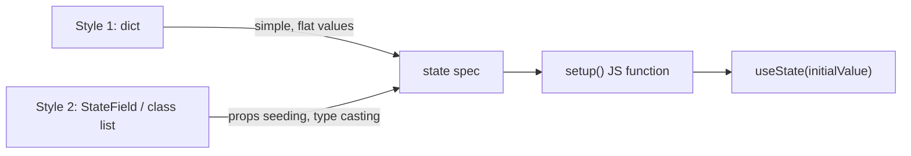
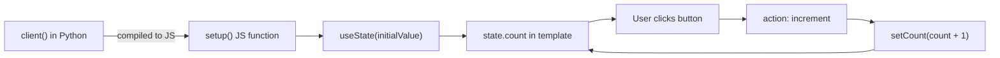
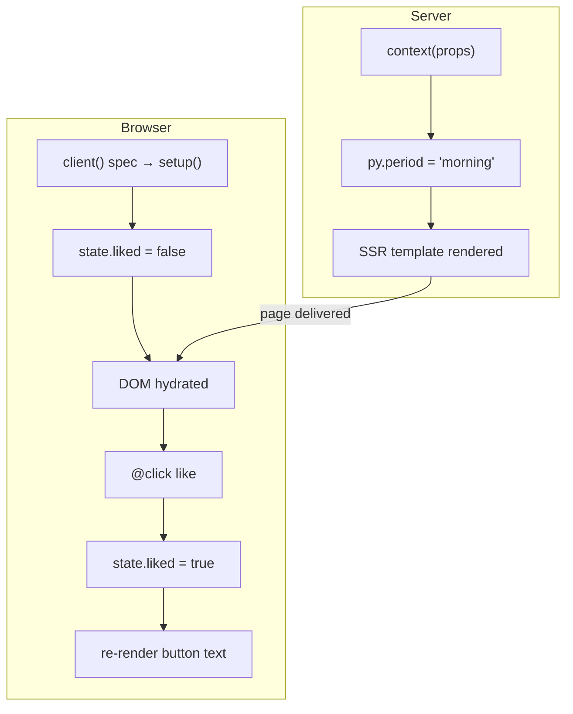

# State

State is reactive data that lives in the browser. When state changes, the component re-renders automatically — no full page reload.

## Two ways to declare state



---

## Style 1 — dict (simple)

The most common approach. Return a `"state"` dict with field names and their initial values:

```python
def client(self):
    return {
        "state": {
            "count":   0,
            "name":    "lua-spa",
            "visible": True,
            "price":   9.99,
        }
    }
```

Use `state.<name>` in the template:

```html
<p>Count: {{ state.count }}</p>
<p l-if="state.visible">{{ state.name }}</p>
```

---

## Style 2 — `StateField` list (typed, prop-seeded)

Use `StateField` when a state field should:
- be **initialised from a prop** passed by the parent, and/or
- be **type-coerced** (HTML attributes are always strings)

```python
from lua_spa.types import StateField

def client(self):
    return {
        "state": [
            StateField(name="count",   from_prop="initialCount", default=0,     cast="int"),
            StateField(name="price",   from_prop="startPrice",   default=0.0,   cast="float"),
            StateField(name="label",   from_prop="label",        default="qty", cast="str"),
            StateField(name="enabled", from_prop="enabled",      default=True,  cast="bool"),
        ]
    }
```

```html
<!-- Parent passes values as HTML attributes -->
<Counter initialCount="5" startPrice="19.99" enabled="true" />
```

| `cast` value | Conversion |
|---|---|
| `"int"` | `Number(value)` → integer |
| `"float"` | `Number(value)` → float |
| `"str"` | stays as string |
| `"bool"` | `Boolean(value)` |
| `"raw"` | no conversion (default) |

---

## Style 2b — inner class list

The same as `StateField`, but using plain Python classes — useful if you prefer a class-oriented style:

```python
def client(self):
    class Count:
        name     = "count"
        default  = 0
        from_prop = "initialCount"
        cast     = "int"

    class Visible:
        name     = "visible"
        default  = True
        cast     = "bool"

    return {
        "state": [Count, Visible]
    }
```

---

## Comparing the two styles

| | Style 1 (dict) | Style 2 (StateField / class) |
|---|---|---|
| Syntax | concise | verbose |
| Seed from prop | ❌ | ✅ |
| Type coercion | ❌ | ✅ |
| Best for | static initial values | dynamic, prop-driven state |

---

## Mutating state via actions

State is **never set directly**. Declare **actions** that describe mutations:

```python
def client(self):
    return {
        "state": {"count": 0, "visible": True},
        "actions": {
            "increment": self.add("count"),
            "decrement": self.sub("count"),
            "reset":     self.set("count", 0),
            "flip":      self.toggle("visible"),
        }
    }
```

| Method | JS equivalent |
|---|---|
| `self.add("x")` | `x = x + 1` |
| `self.add("x", n)` | `x = x + n` |
| `self.sub("x")` | `x = x - 1` |
| `self.sub("x", n)` | `x = x - n` |
| `self.set("x", v)` | `x = v` |
| `self.toggle("x")` | `x = !x` |

## Seeding state from props

> Already covered above in **Style 2**. Quick reference:

```python
from lua_spa.types import StateField

def client(self):
    return {
        "state": [
            StateField(name="count", from_prop="initialCount", default=0, cast="int"),
        ]
    }
```

```html
<Counter initialCount="5" />
```

## State flow diagram



## Working with state using Python methods

Besides the built-in `self.add/sub/set/toggle`, you can define **Python methods** on your component class and call them as actions. The tracing system records the operations they perform and compiles them to JavaScript automatically.

### Example: multi-step action

```python
class Cart(Component):
    def client(self):
        return {
            "state": {
                "quantity": 1,
                "total":    0.0,
            },
            "actions": {
                # Each action is a call to a Python method
                "addOne":     self.increase_quantity(),
                "removeOne":  self.decrease_quantity(),
                "clear":      self.reset_cart(),
            },
        }

    def increase_quantity(self):
        return self.add("quantity")          # quantity += 1

    def decrease_quantity(self):
        return self.sub("quantity")          # quantity -= 1

    def reset_cart(self):
        return [
            self.set("quantity", 0),
            self.set("total", 0.0),
        ]
```

```html
<template>
  <div class="cart">
    <p>Quantity: {{ state.quantity }}</p>
    <p>Total: {{ state.total }}</p>
    <button @click="addOne">+</button>
    <button @click="removeOne">-</button>
    <button @click="clear">Clear</button>
  </div>
</template>
```

> **Note:** returning a **list** of operations from an action executes them all in sequence on the client.

### Example: conditional state with `context()` + `StateField`

`context()` runs on the server and can use any Python logic — database queries, environment variables, complex calculations — to compute the **initial** values that seed client state.

```python
import datetime

class Greeting(Component):
    def context(self, props):
        hour = datetime.datetime.now().hour
        if hour < 12:
            period = "morning"
        elif hour < 18:
            period = "afternoon"
        else:
            period = "evening"
        # Expose to template as {{ py.period }}
        return {"period": period}

    def client(self):
        return {
            "state": {"liked": False},
            "actions": {"like": self.toggle("liked")},
        }
```

```html
<template>
  <div class="greeting">
    <p>Good {{ py.period }}!</p>
    <button @click="like">
      {{ state.liked ? "❤️ Liked" : "🤍 Like" }}
    </button>
  </div>
</template>
```

`context()` (server) and `client()` (browser) are fully independent:


