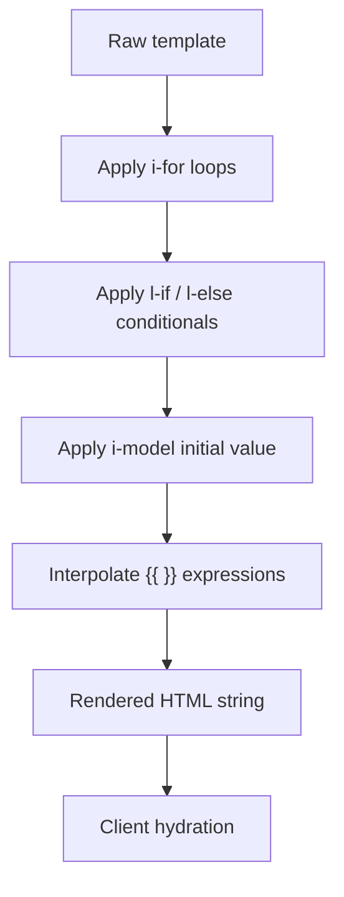

# Templating

moon-spa templates are HTML files with a concise set of directives. Templates are processed **server-side first**, then hydrated client-side.

## Interpolation `{{ }}`

Interpolates an expression result into text or attribute content:

```html
<p>{{ state.count }}</p>
<p>{{ props.name }}</p>
<p>{{ 2 + 2 }}</p>
```

The context available inside `{{ }}`:
- `state` — reactive state object
- `props` — component props
- `py` — namespace populated by `setup().data`

## Conditional rendering

### `l-if` / `l-else-if` / `l-else`

```html
<div l-if="state.count > 10">High</div>
<div l-else-if="state.count > 0">Low</div>
<div l-else>Zero</div>
```

Rules:
- Attributes on **any** HTML element
- `l-else` / `l-else-if` must immediately follow the sibling element with `l-if` / `l-else-if`
- The expression is evamoonted in the full context (`state`, `props`, `py`)

## List rendering `i-for`

```html
<ul>
  <li i-for="item in props.items">{{ item }}</li>
</ul>
```

Multi-target unpacking:

```html
<tr i-for="key, value in props.data">
  <td>{{ key }}</td>
  <td>{{ value }}</td>
</tr>
```

Loop metadata is available as `loop`:

```html
<li i-for="item in props.items">
  {{ loop.index }} - {{ item }}
</li>
```

## Two-way binding `i-model`

Use `i-model` for form controls:

```html
<input i-model="state.name" />
<textarea i-model="state.message"></textarea>
<select i-model="state.role">
  <option value="admin">Admin</option>
  <option value="user">User</option>
</select>
```

Behavior:
- Initial value is rendered from the bound state expression.
- On input/change, runtime updates the bound `state` key and re-renders.
- Works best with `state.*` paths.


## Event binding `@event`

```html
<button @click="increment">+</button>
<input @input="updateName" />
<form @submit="handleSubmit">...</form>
```

The value is the action name inferred from `setup(self, props)` local callables.

## Form submission and state structure

When a form is submitted using `@submit`, all form fields are collected into a dictionary. This dictionary is assigned to a key in the root of the state object, named after the form's `name` attribute. For example, a form with `name="myform"` will have its data available as `state.myform`.

**Key points:**
- The form data is stored at the root of the state, under the form name (e.g., `state.myform`).
- No extra metadata is included—only the form fields and their values.
- The state is updated with the latest form data before the action handler is called.
- In your action, you can access all submitted fields as a dictionary: `state["myform"]["fieldname"]`.

**Example:**

```html
<form name="profile" @submit="saveProfile">
  <input name="username" i-model="state.username" />
  <input name="email" i-model="state.email" />
  <button type="submit">Save</button>
</form>
```

On submit, the state will include:

```python
state = {
  ...,
  "profile": {
    "username": "...",
    "email": "..."
  }
}
```

In your action handler:

```python
def saveProfile(self, state, props):
    profile = state["profile"]
    # profile["username"], profile["email"]
```

This applies to all forms using `@submit`. The state is always synchronized before the action runs.

## Dynamic attributes `:attr`

```html
<div :class="state.visible and 'show' or 'hide'">...</div>

```

`:` evamoontes the expression and applies the result to the attribute name.

## Processing order (server-side)



## Template context reference

| Variable | Type | Source |
|---|---|---|
| `state` | object | `setup()` → `state` section |
| `props` | object | Parent or `spa.config.json` |
| `py.*` | any | `setup().data` |
